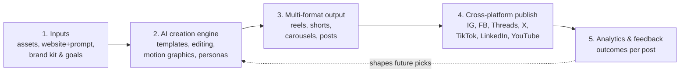

# 00 — Product vision

> Condensed from the master planning doc. The [Google Doc][spec] remains authoritative
> for product strategy; this file exists so agents working in the repo have the context
> without leaving it.

[spec]: https://docs.google.com/document/d/1T-bHH5_KSHjIPfKssy5-HdeO76QIfRGxVKHrYh52J18/edit

## Problem

Small business owners and marketers know they need to post consistently, but most lack
the time, design skill, or strategic insight to do it well. They either hire it out or
reach for generic AI tools that produce content indistinguishable from every other small
business's feed.

Two failures are universal across existing tools:

1. **They don't get smarter about a specific type of business.** Predis.ai's most common
   complaint is that output looks the same regardless of who's using it.
2. **They optimize for engagement, not outcomes.** A small business owner cares about
   leads, saves, calls, and foot traffic far more than views.

## Target user

Small business owners and in-house marketers — the solo owner-operator or single
marketer, not agencies. **Rise & Shore** and **TaxDedux** are the first two accounts and
will migrate onto the platform once v1 is viable, which is why multi-brand support has to
exist in the foundation.

## The wedge

**Template- and trend-driven quick content creation**, differentiated by:

- **Industry-specific relevance** — templates and trends scored against the business
  category, not just brand colors.
- **Outcome-based feedback** — a loop that learns what actually drove results, measured
  in clicks and leads rather than impressions.

## Long-term pipeline

The full vision is a five-stage pipeline with a feedback loop into stage 2:

**V1 implements a narrow slice:** stages 1, 3, 4, a first version of 5, and only the
*templates* portion of stage 2 — no editing, no motion graphics.

## Phasing

| Phase | Scope |
|-------|-------|
| **v1** | Template engine, brand kits, trend engine v0, IG/FB/Threads/X publishing, outcome tracking, feedback loop v0 |
| **v2** | Raw footage video stitching & editing; agency / multi-client mode; analytics depth |
| **v3** | AI motion graphics from prompt; website-to-video demo capture; localization; rights-tracked audio |

Further-out bets: predictive analytics, a template marketplace, a licensable
recommendation layer, AI avatars.

## Anchoring principles

These are decision tiebreakers. When a design choice is close, pick the option that
better serves these.

- **One pipeline, not a shelf of switches.** Every feature must remove a tool someone
  currently uses, not just add a button.
- **Data-informed by default.** Suggestions are backed by performance data, not curator
  taste alone.
- **Analytics are core, not optional.** Every published post gets tracked and fed back
  into what's recommended next. This is the mechanism that makes relevance, personas, and
  timing improve over time instead of shipping as static features.
- **Native quality per platform.** A TikTok export is not a resized LinkedIn post.
  Pacing, captions, and aspect ratio respect each platform's grammar.
- **Fast enough to protect the loop.** Consistency drives organic reach, so idea → published
  is itself a core metric.
- **Joy is a feature.** Personality and easter eggs, not sterile enterprise tooling.
- **Ship the wedge before the whole vision.**

## V1 goals

1. Cut the time from "I need to post something" to a finished, published, platform-native post.
2. Make template and trend suggestions relevant to the specific business category.
3. Build a working feedback loop that visibly improves for an account as it publishes.
4. Prove enough value that a first cohort would switch off their current tool.

## V1 non-goals

Explicitly out of scope — design so they aren't blocked, but do not build:

- Raw footage video stitching/editing (v2)
- AI motion graphics from a prompt (v3)
- Website-to-video demo capture (v3)
- Agency / multi-client workspaces and approvals (v2)
- Native mobile app — web-first
- AI voice cloning / avatars

## Requirements (P0)

- Brand kit: logo, colors, business category, target platforms, and a real brand
  voice/tone guide the user authors — not a one-line descriptor
- Template and trend library tagged and ranked by business-category relevance
  (v1: hand-tagged categories per template; auto-scoring comes once feedback data exists)
- Auto-populate a selected template with the user's photos, copy, and brand kit
- Export in the correct format per platform
- Direct publish or schedule to Instagram, Facebook, Threads, and X
- Per-post performance tracking: reach, saves, link clicks, and native engagement,
  captured per post *and* per platform, rolled up by template, trend, and persona
- **Feedback loop v0:** surface best-performing template types and bias future defaults
  toward them
- Trend data acquisition via in-house collectors

## Requirements (P1)

- TikTok and LinkedIn publishing
- Platform-specific caption/hook rewrite assist
- Two-variant generation for the same template (hook A/B)
- Trend-over-time analytics across templates, personas, and time
- **Personality layers:** the platform suggests 4–5 tone personas from industry, base
  brand voice, and goals. The user can accept, adjust, dismiss, or reroll. Approved layers
  sit on top of the base voice to produce tonally-varied versions of the same post.
- Multiple brand profiles under one account
- Best day/time to post per platform, evolving from best-practice defaults toward
  account-specific timing

## Success metrics

**Leading:** activation (% finishing brand kit setup and publishing within 7 days), time
to first published post, template acceptance rate.

**Lagging:** 30-day return usage, measurable shift toward higher-performing template types
within a user's first month, engagement/conversion lift from personality layers,
conversion to paid.

> No numeric targets are set. Establish a baseline from early users first — do not invent
> targets prematurely.

## Known risks

| Risk | Note |
|------|------|
| Platform publishing APIs | Meta and TikTok require app review; X API has real cost. This is the long pole on "post everywhere". See [08](./08-platform-integrations.md). |
| Compute cost | AI image/video generation is expensive at scale, which is why competitors meter it with credits. Satori rendering sidesteps most of this for v1. |
| Trending audio rights | Platforms clear music natively in-app; a third-party library needs its own licensing path. Out of scope for v1. |
| Website recording (v3) | Must mirror Arcade/Supademo: capture of a site the user controls, not open-ended automation against arbitrary sites. |
