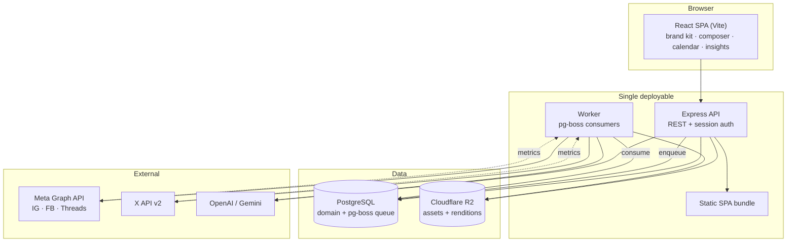

# 01 — Architecture

> **Status:** proposed. Nothing in this document is built yet.

## Design constraints

The architecture is driven by four hard constraints that fall out of the v1 PRD:

1. **Rendering is CPU work, not API work.** Turning a template + brand kit + photos into
   four platform-native images is our core loop. It has to be fast and cheap.
2. **Most of the platform is background work.** Scheduled publishing, metrics polling, and
   trend collection are all recurring jobs. A request/response-only design can't express
   this.
3. **Publishing is gated on third-party approval.** Meta app review sits on the critical
   path. The architecture must let the product be useful before approval lands.
4. **Cost matters more than scale, for now.** Two dogfood accounts, not two thousand
   users. Optimize for a low fixed monthly floor and no idle spend.

## System shape



### Why one deployable

The API already serves the built SPA in production. Keeping that means one process, one
deploy, one log stream, and no CORS or cookie-domain complexity. The worker starts as an
**in-process pg-boss consumer** behind a `WORKER_ENABLED` flag, and splits into its own
process the moment job volume or a slow render starts affecting request latency. That
split is a config change, not a rewrite, because jobs are already durable in Postgres.

## Stack decisions

| Layer | Choice | Why |
|-------|--------|-----|
| API | **Express + TypeScript** | Already in use, already understood, zero migration cost. See [ADR-0003](./adr/0003-stack-express-vite.md). |
| Frontend | **React 18 + Vite + React Router + TanStack Query** | SPA is the right shape for an authenticated tool. Router and a query cache are the two things the current app is missing. |
| ORM / DB | **Prisma + PostgreSQL** | Already in use. Postgres also becomes the job queue and the analytics store. |
| Jobs | **pg-boss** | Durable queues, scheduling, retries, and cron inside the database you already pay for. No Redis. See [ADR-0004](./adr/0004-pg-boss-job-queue.md). |
| Rendering | **Satori → resvg-js → PNG** | Pure JS, no Chromium. ~10–50ms per render vs. hundreds for a headless browser, and it runs in a 512MB container. See [ADR-0002](./adr/0002-satori-template-rendering.md). |
| Object storage | **Cloudflare R2** | S3-compatible with zero egress fees, which matters when every post serves images. |
| Validation | **Zod** | One schema source for API contracts, env vars, and template slot definitions. |
| Testing | **Vitest + Supertest + Testcontainers (or a test Postgres)** | Fast, ESM-native, one runner for both workspaces. |
| Logging | **Pino** | Structured JSON logs; the current app uses bare `console.log`. |
| Auth | **Google OAuth via Passport, Postgres-backed sessions** | Port as-is; move session store off MemoryStore. |

### Why not Next.js

Next.js on Vercel is attractive for DX, and Satori is literally a Vercel library. It loses
on this workload for three reasons: serverless functions have execution ceilings that
fight batch rendering; Vercel Cron is too thin for trend collection and metrics polling,
so you'd need a worker host anyway; and the SEO/SSR benefit doesn't apply to an
authenticated tool. A future marketing site should be a separate static site, which is
cheaper than either option.

### Why not Redis

The only thing Redis would buy at this stage is a job queue, and pg-boss provides durable
queues, delayed jobs, cron scheduling, retries with backoff, and dead-letter queues using
Postgres primitives. Adding Redis means another managed service, another connection
string, and another bill for a system with two dogfood accounts.

## Layering

Enforced by directory structure and reviewed in PRs. The current codebase puts HTTP
handling, business logic, and third-party calls in the same file (`social.routes.ts` is
845 lines); this is the correction.

```
backend/src/
  http/           # Express wiring: routers, middleware, request/response mapping only
    routes/
    middleware/
  modules/        # One folder per bounded context. Business logic lives here.
    identity/     # users, workspaces, memberships, sessions
    brand/        # brand kits, voice guides, personas, assets
    template/     # template registry, slot schemas, relevance tagging
    render/       # Satori pipeline, per-platform renditions
    publish/      # platform adapters, post scheduling, publish jobs
    trend/        # collectors, normalization, scoring
    insight/      # short links, click ingest, metrics ingest, rollups
    recommend/    # feedback loop, template scoring
    ai/           # provider abstraction (ported)
  jobs/           # pg-boss registration, handlers, cron definitions
  platform/       # cross-cutting: db client, config, logger, storage, crypto, errors
  types/
```

**Rules:**

- `http/` may import from `modules/`. `modules/` must never import from `http/`.
- Modules communicate through exported service functions, never by reaching into another
  module's Prisma queries.
- Every external API client lives behind an interface in its module so it can be faked in
  tests.

## Key interfaces

These three interfaces are the extension points that keep v2/v3 unblocked. Define them
early even when there is only one implementation.

### `PlatformAdapter`

Every social platform implements the same contract. Adding TikTok or LinkedIn later is a
new file, not a change to the publishing pipeline.

```ts
interface PlatformAdapter {
  readonly platform: Platform;
  readonly specs: PlatformSpec;              // aspect ratios, caption limits, media rules

  connect(code: string, redirectUri: string): Promise<ConnectedAccount>;
  refresh(account: SocialAccount): Promise<TokenSet>;
  publish(input: PublishInput): Promise<PublishResult>;
  fetchMetrics(target: PostTarget): Promise<PlatformMetrics>;
}
```

### `TrendCollector`

A source of trend signals. Manual curation is just another collector, which is what lets
the product work on day one while automated collectors mature.

```ts
interface TrendCollector {
  readonly id: string;
  readonly platform: Platform | 'manual';
  collect(ctx: CollectContext): Promise<RawTrendSignal[]>;
}
```

### `Renderer`

Satori is the v1 implementation. Video and motion-graphics renderers in v2/v3 implement
the same interface.

```ts
interface Renderer {
  readonly kind: 'image' | 'carousel' | 'video';
  render(template: ResolvedTemplate, spec: RenditionSpec): Promise<RenderedAsset>;
}
```

## Cross-cutting concerns the current code lacks

Each of these is a foundation task in [phase 1](./04-phase-1-roadmap.md), because
retrofitting them is far more expensive than starting with them.

| Concern | Current state | Target |
|---------|---------------|--------|
| **Secret storage** | OAuth tokens stored plaintext in `users` columns | AES-256-GCM envelope encryption at the ORM boundary, key from env, rotatable |
| **Config** | `process.env` read ad hoc, silent fallbacks like `'your-secret-key'` | Zod-validated config module; process refuses to boot on missing/invalid vars |
| **Errors** | Inconsistent try/catch, leaked messages | Typed `AppError` hierarchy, one error middleware, no internal details to clients |
| **Logging** | `console.log`, including auth session contents | Pino with redaction of tokens and PII, request IDs |
| **Sessions** | Default MemoryStore | `connect-pg-simple` against Postgres (dependency is already installed, just unused) |
| **Testing** | None | Vitest; unit tests for scoring/rendering logic, integration tests for publish flows against faked adapters |
| **Lint** | `lint` scripts exist but no ESLint config file — they fail | Flat ESLint config at root, shared by both workspaces |
| **CI** | None | GitHub Actions: typecheck, lint, test, build on every PR |
| **Rate limiting** | None | Per-IP on auth and short-link endpoints; per-account on AI generation |

## Environments

| Env | Hosting | Database | Notes |
|-----|---------|----------|-------|
| Local | `npm run dev` | Local Postgres or Docker | R2 replaced by a local filesystem storage driver |
| Staging | Render/Fly free or smallest tier | Neon free tier | Meta test app, X sandbox |
| Production | Render/Fly | Neon or provider Postgres | Real Meta app, real X app |

Storage is accessed through a `StorageDriver` interface so local development never needs
R2 credentials.

## Cost model (early stage)

| Item | Estimate |
|------|----------|
| App hosting (1 small instance) | $0–7/mo |
| Postgres (Neon free → paid) | $0–19/mo |
| R2 storage + egress | ~$0 at this volume (zero egress) |
| AI generation (copy only, Satori does visuals) | usage-based, single-digit dollars |
| X API tier | see [08](./08-platform-integrations.md) — the main fixed cost |

The deliberate outcome: **no fixed infrastructure cost that scales with idle time.** The
largest line item is the X API tier, which is a product decision rather than an
architecture one.
