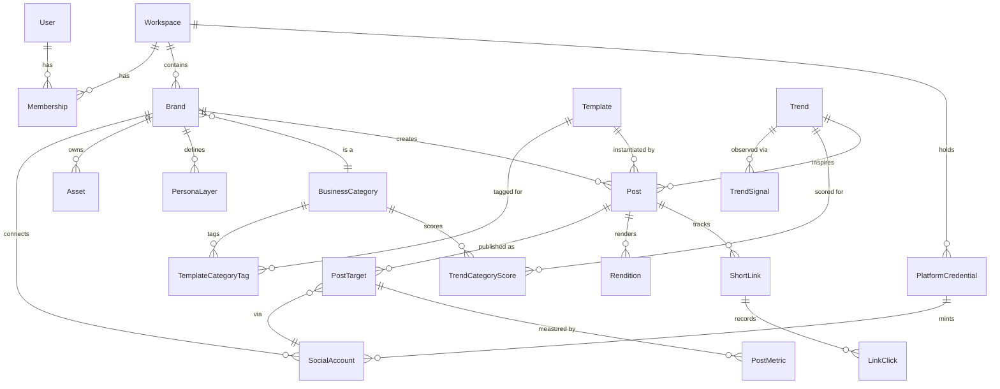

# 02 — Data model

> **Status:** implemented in W2 (`backend/prisma/schema.prisma`, `0001_init`). The
> prototype schema was dropped entirely — there was no production data. See
> [ADR-0001](./adr/0001-clean-foundation-reset.md). The `prisma` blocks below are the
> design sketches the implementation was built from; where the two differ, the schema file
> wins and the difference is recorded under
> [What changed during implementation](#what-changed-during-implementation-w2).

## Why the current schema can't evolve into this

| Current | Problem |
|---------|---------|
| OAuth tokens as columns on `users` (`twitterAccessToken`, `linkedinAccessToken`, `canva*`) | One account per platform per *person*. The model can't express "TaxDedux's Instagram" vs "Rise & Shore's Instagram", and adding a platform means a migration plus new columns. |
| `Template { name, purpose }` | A stub. Carries no layout, no slots, no category relevance — none of what a template actually is here. |
| `GenerationRequest` doubles as post history | Conflates "we called an LLM" with "a post exists". Post lifecycle, per-platform targets, and per-platform results are crammed into boolean/ID column pairs per network. |
| `ScheduledPost.platform` as `'twitter' \| 'linkedin' \| 'both'` | Doesn't generalize past two platforms, and per-platform success/failure is duplicated into parallel columns. |
| No brand, no category, no assets, no metrics | The entire v1 wedge has nowhere to live. |

## Domain overview



## Tenancy: Workspace → Brand

`Brand` is first-class from day one ([ADR-0008](./adr/0008-brand-first-class.md)). The
PRD lists multi-brand as P1, but it is a *schema* concern, not a UI concern — Rise & Shore
and TaxDedux both migrate onto the platform, so two brands exist on day one. Retrofitting
a tenant boundary after posts, assets, and metrics exist is one of the most expensive
migrations a product can do.

`Workspace` is the billing and membership boundary. In v1 every user gets exactly one
workspace, auto-created at signup, and the UI may hide it entirely. It exists because
agency mode (v2) needs it, and adding it later would require the same painful backfill.

**Rule: every user-owned row is reachable from a `brandId` or `workspaceId`.** Every query
in a request path filters on it. No exceptions.

## Entities

### Identity & tenancy

```prisma
model User {
  id          String       @id @default(uuid())
  email       String       @unique
  name        String?
  googleId    String?      @unique
  picture     String?
  createdAt   DateTime     @default(now())
  updatedAt   DateTime     @updatedAt
  memberships Membership[]

  @@map("users")
}

model Workspace {
  id          String       @id @default(uuid())
  name        String
  slug        String       @unique
  createdAt   DateTime     @default(now())
  updatedAt   DateTime     @updatedAt
  memberships Membership[]
  brands      Brand[]

  @@map("workspaces")
}

model Membership {
  id          String    @id @default(uuid())
  userId      String
  workspaceId String
  role        Role      @default(OWNER)
  createdAt   DateTime  @default(now())
  user        User      @relation(fields: [userId], references: [id], onDelete: Cascade)
  workspace   Workspace @relation(fields: [workspaceId], references: [id], onDelete: Cascade)

  @@unique([userId, workspaceId])
  @@map("memberships")
}

enum Role {
  OWNER
  ADMIN
  MEMBER
}
```

### Business category taxonomy

The backbone of "industry-specific relevance." A shallow two-level taxonomy (~8 parents,
~60 leaves) is enough for v1 and keeps hand-tagging tractable.

```prisma
model BusinessCategory {
  id           String                @id @default(uuid())
  slug         String                @unique   // "coffee-shop", "tax-prep"
  name         String
  parentId     String?
  parent       BusinessCategory?     @relation("CategoryTree", fields: [parentId], references: [id])
  children     BusinessCategory[]    @relation("CategoryTree")
  // Cold-start priors: which template archetypes historically work for this category.
  // Seeded by hand, overwritten by aggregate data once the feedback loop has volume.
  priors       Json?
  brands       Brand[]
  templateTags TemplateCategoryTag[]
  trendScores  TrendCategoryScore[]

  @@map("business_categories")
}
```

### Brand kit

```prisma
model Brand {
  id            String            @id @default(uuid())
  workspaceId   String
  workspace     Workspace         @relation(fields: [workspaceId], references: [id], onDelete: Cascade)
  name          String
  slug          String
  website       String?
  categoryId    String?
  category      BusinessCategory? @relation(fields: [categoryId], references: [id])

  // Visual identity
  logoAssetId   String?
  logo          Asset?            @relation("BrandLogo", fields: [logoAssetId], references: [id])
  palette       Json              // { primary, secondary, accent, neutral, background, text }
  typography    Json              // { headingFamily, bodyFamily, headingWeight, ... }

  // Voice: a real guide the user authors, not a one-line descriptor
  voiceGuide    Json              // { summary, toneAttributes[], doSay[], dontSay[],
                                  //   vocabulary[], sampleCopy[], readingLevel, emojiPolicy }
  goals         Json?             // { primaryGoal, targetAudience, callsToAction[] }
  targetPlatforms Platform[]

  // IANA zone, e.g. "America/New_York" — never a UTC offset, which changes twice a year.
  // Guessed from the browser at creation; always user-editable. See 06.
  timezone      String            @default("America/New_York")

  // Soft delete: a brand carries posts, metrics and credentials, so removal is
  // recoverable. Every read path filters `deletedAt: null`.
  deletedAt     DateTime?
  createdAt     DateTime          @default(now())
  updatedAt     DateTime          @updatedAt

  socialAccounts SocialAccount[]
  assets         Asset[]          @relation("BrandAssets")
  personas       PersonaLayer[]
  posts          Post[]
  shortLinks     ShortLink[]

  @@unique([workspaceId, slug])
  @@map("brands")
}
```

**Design note — `voiceGuide` as JSON.** The voice guide's shape will churn heavily as the
persona feature (P1) develops. JSON with a Zod schema at the application boundary gives
schema validation without a migration per field. The same reasoning applies to `palette`,
`typography`, and `goals`. Anything we need to *query or aggregate on* stays a real column.

### Personas (P1, modeled in v1)

```prisma
model PersonaLayer {
  id          String   @id @default(uuid())
  brandId     String
  brand       Brand    @relation(fields: [brandId], references: [id], onDelete: Cascade)
  name        String                       // "The Straight Shooter"
  description String?
  modifiers   Json                         // tone deltas layered over Brand.voiceGuide
  status      PersonaStatus @default(SUGGESTED)
  source      String        @default("ai") // "ai" | "user"
  createdAt   DateTime @default(now())
  posts       Post[]

  @@map("persona_layers")
}

enum PersonaStatus {
  SUGGESTED
  APPROVED
  DISMISSED
}
```

The status enum directly encodes the PRD's interaction model: the platform suggests, the
user accepts / adjusts / dismisses / rerolls.

### Social accounts

Replaces every `*AccessToken` column on `User`. Tokens are **encrypted at rest** via a
Prisma middleware or field extension — never stored plaintext.

```prisma
model SocialAccount {
  id                String        @id @default(uuid())
  brandId           String
  brand             Brand         @relation(fields: [brandId], references: [id], onDelete: Cascade)
  platform          Platform
  externalId        String        // platform-side account/page/user id
  handle            String?
  displayName       String?
  avatarUrl         String?

  accessToken       String        // encrypted
  refreshToken      String?       // encrypted
  tokenSecret       String?       // encrypted; OAuth 1.0a (X) only
  expiresAt         DateTime?
  scopes            String[]

  // Which platform app minted this token. Only that app can refresh it.
  // null = minted by the Buzzalicious PLATFORM_APP.
  credentialId      String?
  credential        PlatformCredential? @relation(fields: [credentialId], references: [id])

  // IG needs a linked FB Page; Threads needs its own token. Adapter-specific data here.
  platformMeta      Json?

  status            AccountStatus @default(ACTIVE)
  lastError         String?
  lastValidatedAt   DateTime?
  createdAt         DateTime      @default(now())
  updatedAt         DateTime      @updatedAt
  postTargets       PostTarget[]

  @@unique([brandId, platform, externalId])
  @@index([status, expiresAt])
  @@map("social_accounts")
}

enum Platform {
  INSTAGRAM
  FACEBOOK
  THREADS
  X
  LINKEDIN     // P1
  TIKTOK       // P1
  YOUTUBE      // later
}

enum AccountStatus {
  ACTIVE
  EXPIRED
  REVOKED
  ERROR
}
```

### Platform credentials

Clients bring their own platform app credentials ([ADR-0009](./adr/0009-byo-platform-credentials.md)).
The full model, encryption scheme, and access log live in
[10 — Credentials & security](./10-credentials-and-security.md); W2 owns creating the
migration for them alongside the rest of the schema.

Shape, in brief:

```prisma
model PlatformCredential {
  id              String   @id @default(uuid())
  workspaceId     String
  brandId         String?             // null = shared across the workspace
  platform        Platform
  label           String
  appId           String?
  appSecret       String?             // encrypted
  systemUserToken String?             // encrypted
  grantedScopes   String[]
  requiredScopes  String[]
  capabilities    Json?
  status          CredentialStatus @default(PENDING)
  socialAccounts  SocialAccount[]
  // ...see doc 10 for the complete definition
  @@map("platform_credentials")
}
```

> `SocialAccount.credentialId` is load-bearing. A workspace can hold more than one app per
> platform, and a token is only refreshable by the app that issued it — without the link,
> tokens become unrecoverable at expiry.

The `@@index([status, expiresAt])` supports a proactive token-refresh job — expiry is a
leading cause of silent publish failure, and the current prototype only discovers it at
post time.

### Assets

```prisma
model Asset {
  id          String   @id @default(uuid())
  brandId     String
  brand       Brand    @relation("BrandAssets", fields: [brandId], references: [id], onDelete: Cascade)
  kind        AssetKind
  storageKey  String                 // R2 object key
  mimeType    String
  width       Int?
  height      Int?
  bytes       Int
  checksum    String?
  source      String   @default("upload")
  altText     String?
  tags        String[]
  createdAt   DateTime @default(now())
  brandLogos  Brand[]  @relation("BrandLogo")

  @@index([brandId, kind])
  @@map("assets")
}

enum AssetKind {
  LOGO
  PHOTO
  VIDEO
  FONT
  RENDITION
}
```

### Templates

The heart of the wedge. See [05 — Template engine](./05-template-engine.md) for how
`slotSchema` and `layout` are actually consumed.

```prisma
model Template {
  id             String   @id @default(uuid())
  slug           String   @unique
  name           String
  description    String?
  archetype      String              // "before-after", "tip-list", "testimonial", "stat-callout"
  kind           TemplateKind @default(IMAGE)

  // null = platform-global, which every v1 template is. Reserved so client-specific
  // templates are additive rather than a migration of every row. See ADR-0010.
  workspaceId    String?
  workspace      Workspace? @relation(fields: [workspaceId], references: [id], onDelete: Cascade)

  // What the user must supply: named, typed slots (Zod-validated at the boundary)
  slotSchema     Json

  // The renderable definition consumed by the Satori pipeline
  layout         Json
  supportedRatios AspectRatio[]

  version        Int      @default(1)
  status         TemplateStatus @default(DRAFT)
  createdAt      DateTime @default(now())
  updatedAt      DateTime @updatedAt

  categoryTags   TemplateCategoryTag[]
  posts          Post[]

  @@index([status, archetype])
  @@map("templates")
}

model TemplateCategoryTag {
  templateId String
  categoryId String
  // Hand-assigned 0..1 relevance for v1; auto-scored once feedback data exists
  weight     Float            @default(1.0)
  source     String           @default("manual")
  template   Template         @relation(fields: [templateId], references: [id], onDelete: Cascade)
  category   BusinessCategory @relation(fields: [categoryId], references: [id], onDelete: Cascade)

  @@id([templateId, categoryId])
  @@map("template_category_tags")
}

enum TemplateKind { IMAGE CAROUSEL TEXT_ONLY VIDEO }
enum TemplateStatus { DRAFT PUBLISHED ARCHIVED }
enum AspectRatio { SQUARE_1_1 PORTRAIT_4_5 STORY_9_16 LANDSCAPE_16_9 }
```

**Versioning matters.** Performance is attributed to a template, so editing a template
in place would silently corrupt the feedback loop. `Post` stores `templateVersion`
alongside `templateId`; a breaking layout change bumps the version.

### Trends

See [07 — Trend engine](./07-trend-engine.md).

```prisma
model Trend {
  id            String     @id @default(uuid())
  platform      Platform?
  kind          TrendKind
  externalRef   String?               // hashtag, sound id, format id
  title         String
  description   String?
  exampleUrls   String[]
  firstSeenAt   DateTime   @default(now())
  lastSeenAt    DateTime   @default(now())
  peakedAt      DateTime?
  status        TrendStatus @default(EMERGING)
  velocity      Float?                // normalized rate of change
  momentum      Float?                // composite score, see doc 07
  raw           Json?
  signals       TrendSignal[]
  categoryScores TrendCategoryScore[]
  posts         Post[]

  @@unique([platform, kind, externalRef])
  @@index([status, momentum])
  @@map("trends")
}

model TrendSignal {
  id          String   @id @default(uuid())
  trendId     String
  trend       Trend    @relation(fields: [trendId], references: [id], onDelete: Cascade)
  collectorId String                  // "meta-hashtag", "x-search", "manual"
  observedAt  DateTime @default(now())
  metrics     Json                    // { volume, engagement, postCount, ... }

  @@index([trendId, observedAt])
  @@map("trend_signals")
}

model TrendCategoryScore {
  trendId    String
  categoryId String
  score      Float
  computedAt DateTime @default(now())
  trend      Trend            @relation(fields: [trendId], references: [id], onDelete: Cascade)
  category   BusinessCategory @relation(fields: [categoryId], references: [id], onDelete: Cascade)

  @@id([trendId, categoryId])
  @@map("trend_category_scores")
}

enum TrendKind { HASHTAG SOUND FORMAT TOPIC }
enum TrendStatus { EMERGING PEAKING DECLINING STALE }
```

Keeping raw `TrendSignal` observations separate from the scored `Trend` means the scoring
algorithm can be re-run over history when it changes — essential while the engine is
being tuned.

### Posts & publishing

The central correction to the current model: a `Post` is the creative unit, and a
`PostTarget` is one platform's copy of it, with its own lifecycle, copy, rendition, and
metrics.

```prisma
model Post {
  id              String   @id @default(uuid())
  brandId         String
  brand           Brand    @relation(fields: [brandId], references: [id], onDelete: Cascade)

  templateId      String?
  template        Template? @relation(fields: [templateId], references: [id])
  templateVersion Int?
  trendId         String?
  trend           Trend?    @relation(fields: [trendId], references: [id])
  personaId       String?
  persona         PersonaLayer? @relation(fields: [personaId], references: [id])

  title           String?
  slotValues      Json?                 // user-supplied values for Template.slotSchema
  baseCopy        String?  @db.Text     // pre-platform-adaptation caption
  status          PostStatus @default(DRAFT)

  // v1 ships IMAGE and TEXT. VIDEO is reserved — see Q21.
  mediaType       MediaType @default(IMAGE)

  // Scheduling stores the UTC instant AND the intent behind it. Without the local
  // time + zone, "every Tuesday at 9am" silently drifts across DST. See 06.
  scheduledAt     DateTime?             // UTC instant
  scheduledLocal  String?               // "2026-10-07T09:00" as the user meant it
  scheduledTz     String?               // IANA zone at the time of scheduling
  scheduleSource  ScheduleSource @default(USER)
  scheduleSlot    String?               // learned-slot key, e.g. "weekday:midday"

  // A/B support (P1): variants share a variantGroupId
  variantGroupId  String?
  variantLabel    String?

  deletedAt       DateTime?
  createdAt       DateTime @default(now())
  updatedAt       DateTime @updatedAt

  targets         PostTarget[]
  renditions      Rendition[]
  shortLinks      ShortLink[]
  generations     AiGeneration[]

  @@index([brandId, status, createdAt])
  @@map("posts")
}

model PostTarget {
  id              String   @id @default(uuid())
  postId          String
  post            Post     @relation(fields: [postId], references: [id], onDelete: Cascade)
  platform        Platform
  socialAccountId String?
  socialAccount   SocialAccount? @relation(fields: [socialAccountId], references: [id])

  caption         String?  @db.Text     // platform-adapted copy
  renditionId     String?
  rendition       Rendition? @relation(fields: [renditionId], references: [id])

  scheduledFor    DateTime?
  status          TargetStatus @default(DRAFT)
  externalPostId  String?
  externalUrl     String?
  publishedAt     DateTime?
  attempts        Int      @default(0)
  lastError       String?

  metrics         PostMetric[]

  // One post publishes at most once per platform. Without this, a retry that re-creates
  // rather than updates silently double-posts.
  @@unique([postId, platform])
  @@index([status, scheduledFor])
  @@index([publishedAt])
  @@map("post_targets")
}

model Rendition {
  id           String      @id @default(uuid())
  postId       String
  post         Post        @relation(fields: [postId], references: [id], onDelete: Cascade)
  mediaType    MediaType   @default(IMAGE)
  aspectRatio  AspectRatio
  storageKey   String
  mimeType     String      @default("image/png")
  width        Int
  height       Int
  durationMs   Int?        // video only; null for image
  bytes        Int
  renderedAt   DateTime    @default(now())
  rendererMeta Json?       // satori/resvg versions, template version, timing
  targets      PostTarget[]

  @@index([postId, aspectRatio])
  @@map("renditions")
}

// v1 produces IMAGE and TEXT posts. VIDEO is declared but not implemented —
// it is its own development track (Q21). Declaring it now keeps the field
// present so no code path hardcodes "always a PNG".
enum MediaType {
  IMAGE
  TEXT
  VIDEO
}

enum ScheduleSource {
  USER        // user picked the time
  SUGGESTED   // user accepted a learned suggestion
  EXPLORATION // deliberately under-sampled slot, for learning
}

enum PostStatus { DRAFT READY SCHEDULED PUBLISHING PUBLISHED PARTIALLY_PUBLISHED FAILED ARCHIVED }
enum TargetStatus { DRAFT SCHEDULED PUBLISHING PUBLISHED FAILED CANCELLED }
```

`mediaType` on `Post` and `Rendition` is the cheap half of video readiness. A **text-only**
post has no rendition at all, so the composer and publish pipeline must already tolerate
zero renditions — which is also what makes X and Threads text posts work in v1.

`scheduleSource` exists so the feedback loop can tell the difference between a time the
user chose and a time the system suggested. Without it, the model trains on its own
suggestions and mistakes that for evidence — a feedback loop measuring its own echo.

`PARTIALLY_PUBLISHED` is deliberate: cross-posting to four platforms fails partially far
more often than it fails completely, and the current model has no way to say so.

### Outcomes: short links and metrics

See [06 — Outcome & feedback loop](./06-outcome-and-feedback-loop.md).

```prisma
model ShortLink {
  id             String   @id @default(uuid())
  slug           String   @unique        // short, URL-safe
  brandId        String
  brand          Brand    @relation(fields: [brandId], references: [id], onDelete: Cascade)
  postId         String?
  post           Post?    @relation(fields: [postId], references: [id], onDelete: SetNull)
  platform       Platform?               // per-platform link = per-platform attribution
  destinationUrl String
  createdAt      DateTime @default(now())
  expiresAt      DateTime?
  clicks         LinkClick[]

  @@index([brandId, createdAt])
  @@map("short_links")
}

model LinkClick {
  id           String   @id @default(uuid())
  shortLinkId  String
  shortLink    ShortLink @relation(fields: [shortLinkId], references: [id], onDelete: Cascade)
  occurredAt   DateTime @default(now())
  ipHash       String?                  // salted hash, never the raw IP
  userAgent    String?
  referrer     String?
  country      String?
  deviceType   String?
  isBot        Boolean  @default(false)

  @@index([shortLinkId, occurredAt])
  @@map("link_clicks")
}

model PostMetric {
  id            String   @id @default(uuid())
  postTargetId  String
  postTarget    PostTarget @relation(fields: [postTargetId], references: [id], onDelete: Cascade)
  capturedAt    DateTime @default(now())
  source        String                 // "platform-api" | "first-party"

  impressions   Int?
  reach         Int?
  likes         Int?
  comments      Int?
  shares        Int?
  saves         Int?
  videoViews    Int?
  profileVisits Int?
  linkClicks    Int?                   // first-party, from LinkClick
  raw           Json?

  @@unique([postTargetId, capturedAt])
  @@index([postTargetId, capturedAt])
  @@map("post_metrics")
}
```

**Metrics are stored as time-series snapshots, not mutable totals.** Platform counters
move for days after publish; snapshots let you compute velocity, compare like-for-like at
"24h after publish", and recover from a bad ingest. A mutable counter column throws all of
that away.

`isBot` exists because link-preview crawlers from every platform will hit short links
immediately on publish. Unfiltered, they would poison the outcome signal that the entire
feedback loop rests on.

### AI telemetry (ported concept)

The existing `GenerationRequest` cost/latency tracking is genuinely useful and survives —
narrowed to its actual job.

```prisma
model AiGeneration {
  id               String   @id @default(uuid())
  brandId          String?
  brand            Brand?   @relation(fields: [brandId], references: [id], onDelete: Cascade)
  postId           String?
  post             Post?    @relation(fields: [postId], references: [id], onDelete: SetNull)
  purpose          String            // "caption" | "persona-suggestion" | "hook-rewrite"
  provider         String
  model            String?
  prompt           String   @db.Text
  response         String   @db.Text
  responseTimeMs   Int?
  promptTokens     Int?
  completionTokens Int?
  estimatedCost    Float?
  createdAt        DateTime @default(now())

  @@index([brandId, createdAt])
  @@map("ai_generations")
}
```

## Conventions

- **UUID v4 primary keys**, `@default(uuid())`, snake_case table names via `@@map`.
- **Soft deletes only where recovery matters** (`Post`, `Brand`), via a nullable
  `deletedAt`. Everything else deletes hard via cascade.
- **JSON columns are Zod-validated at the application boundary**, never trusted raw. Each
  schema is exported from the module that owns the entity — see
  [JSON column contracts](#json-column-contracts).
- **No cross-brand foreign keys.** A query that can't be scoped by `brandId` is a design
  smell.
- **Timestamps are `DateTime` UTC.** The per-brand IANA zone is its own column,
  `Brand.timezone` — not a field inside `Brand.goals`. Scheduling intent is stored
  alongside the UTC instant as `Post.scheduledLocal` + `Post.scheduledTz`; see
  [06](./06-outcome-and-feedback-loop.md).

## Encryption at rest

`SocialAccount.accessToken` / `refreshToken` / `tokenSecret` and
`PlatformCredential.appSecret` / `directToken` / `directTokenSecret` / `systemUserToken`
are encrypted by a Prisma client extension (`backend/src/platform/prisma-encryption.ts`)
built on `platform/crypto.ts`. Plaintext never reaches the database; reads decrypt
transparently, including through nested `include`s.

Two consequences callers must know about:

- **Encrypted fields cannot be filtered, ordered, or used in a compound `where`.** AES-GCM
  output is non-deterministic, so the same plaintext encrypts differently every time. The
  extension throws rather than silently matching nothing.
- **Ciphertext is versioned** (`v1.<keyId>.<iv>.<tag>.<ciphertext>`), so W6's upgrade to
  per-workspace DEKs ([10](./10-credentials-and-security.md)) is an incremental
  re-encryption, not a flag day.

## JSON column contracts

Every JSON column has an exported Zod schema colocated with the module that owns the
entity. These are the contracts other workstreams code against; validate at the boundary
rather than trusting a column.

| Column | Schema | Module |
|--------|--------|--------|
| `Brand.palette` | `BrandPaletteSchema` | `modules/brand/brand.schemas.ts` |
| `Brand.typography` | `BrandTypographySchema` | `modules/brand/brand.schemas.ts` |
| `Brand.voiceGuide` | `BrandVoiceGuideSchema` | `modules/brand/brand.schemas.ts` |
| `Brand.goals` | `BrandGoalsSchema` | `modules/brand/brand.schemas.ts` |
| `PersonaLayer.modifiers` | `PersonaModifiersSchema` | `modules/brand/persona.schemas.ts` |
| `BusinessCategory.priors` | `CategoryPriorsSchema` | `modules/brand/category.schemas.ts` |
| `Template.slotSchema` | `SlotSchemaSchema` | `modules/template/template.schemas.ts` |
| `Template.layout` | `TemplateLayoutSchema` | `modules/template/template.schemas.ts` |
| `Post.slotValues` | `SlotValuesSchema` | `modules/template/template.schemas.ts` |
| `SocialAccount.platformMeta` | `PlatformMetaSchema` | `modules/publish/credential.schemas.ts` |
| `PlatformCredential.capabilities` | `CredentialCapabilitiesSchema` | `modules/publish/credential.schemas.ts` |
| `Trend.raw` | `TrendRawSchema` | `modules/trend/trend.schemas.ts` |
| `TrendSignal.metrics` | `TrendSignalMetricsSchema` | `modules/trend/trend.schemas.ts` |
| `Rendition.rendererMeta` | `RendererMetaSchema` | `modules/render/rendition.schemas.ts` |
| `PostMetric.raw` | `PostMetricRawSchema` | `modules/insight/metric.schemas.ts` |

`TemplateLayoutSchema` is the contract W4's layout compiler renders from. It encodes the
node union and the `$brand.*` / `$slot.*` / `$scale(n)` / `$fit(max, min)` binding grammar
defined in [05](./05-template-engine.md), and every seeded template is parsed through it in
a test — a layout the compiler could not consume cannot reach the database.

## What changed during implementation (W2)

The sketches above are what W2 built, with these deliberate differences. Recorded here
because this document is the contract other workstreams read.

**`Template.workspaceId` exists and is nullable.** The W2 brief asks that templates carry
no `workspaceId`; [ADR-0010](./adr/0010-workspace-per-client.md) asks that the column exist
as nullable from the start so client-specific templates are additive. These are the same
requirement stated from two directions: what templates must not have is a *required* tenant
column that would partition the shared library. `null` means global, every seeded template
is global, and no v1 code path writes a non-null value.

**`Brand.deletedAt` and `Post.deletedAt` are real columns.** The conventions section called
for soft deletes on both, but neither model declared the field. Added, with
`@@index([workspaceId, deletedAt])` and `@@index([brandId, deletedAt])` so the filter is
cheap. Read paths must filter `deletedAt: null`; this is not enforced by the database.

**`AiGeneration.brandId` is a real foreign key**, not a bare string. ADR-0010 makes
offboarding "`DELETE FROM workspaces` and cascade"; a dangling `brandId` would have left
prompt and response text behind after a client left. It cascades from `Brand`.

**`Workspace.slug` added.** Workspaces are addressable tenants, and the seed needs a stable
natural key to be idempotent against.

**`PostTarget` gained `@@unique([postId, platform])`.** One post publishes at most once per
platform. Without the constraint, a retry that re-creates rather than updates silently
double-posts — the failure mode is invisible until a client sees it in their feed.

**Timestamps filled in.** Several sketched models had `createdAt` but no `updatedAt`
(`BusinessCategory`, `PersonaLayer`, `Asset`, `Trend`, `PostTarget`). Added for consistency.

**Referential actions made explicit.** Optional parents (`Post.template`, `Post.trend`,
`Post.persona`, `PostTarget.socialAccount`, `PostTarget.rendition`,
`SocialAccount.credential`, `Brand.category`) are `SetNull`, so losing a parent degrades a
row rather than deleting history. `Brand.logo` is `NoAction` specifically: `Brand → Asset`
already cascades, and a second action back would form a cycle Postgres refuses to create.

**Secondary indexes added** for foreign keys that are joined but were not covered:
`memberships(workspaceId, role)`, `business_categories(parentId)`,
`social_accounts(credentialId)`, `platform_credentials(brandId)`,
`template_category_tags(categoryId, weight)`, `trend_category_scores(categoryId, score)`,
`posts(brandId, scheduleSlot)`, `posts(variantGroupId)`, `short_links(postId)`,
`link_clicks(shortLinkId, isBot, occurredAt)`, `ai_generations(postId)`.

## Migration strategy

Because no data is worth preserving:

1. Delete `backend/prisma/migrations/` entirely and `migrate-social-data.sql`.
2. Write the new `schema.prisma` in one pass.
3. Generate a single `0001_init` migration.
4. Build a seed script covering: the business-category taxonomy, 8–12 published
   templates with category tags, and the Rise & Shore + TaxDedux workspaces.

The seed script is not a nicety — it is the only way subsequent agents can work on
recommendation and rendering code without hand-creating fixtures.

### Seeded data

`npm run db:seed` is idempotent: every row's UUID is derived deterministically from a
stable natural key, so each write is an upsert by id and a re-run is a no-op. Generated
numbers come from a seeded PRNG, so two runs produce identical data.

It creates two **workspaces** — Rise & Shore and TaxDedux — not two brands in one
workspace ([ADR-0010](./adr/0010-workspace-per-client.md)), with deliberately different
posting histories so recommendation and send-time differences are visible rather than
theoretical. Posts are spread across all eight send-time buckets (weekday/weekend ×
four dayparts, [06](./06-outcome-and-feedback-loop.md)), at least one schedule crosses a
US DST transition, and at least one TaxDedux post is `MediaType.TEXT` with **zero**
renditions — the path a publish pipeline is most likely to assume away.

> **Seeded credentials are unmistakably fake**, e.g.
> `seed-fake-not-a-real-token-instagram`. Seed data gets copied by people who assume it is
> inert, so a realistic-looking secret in a seed file is a future incident. Being visibly
> fake is the feature.
