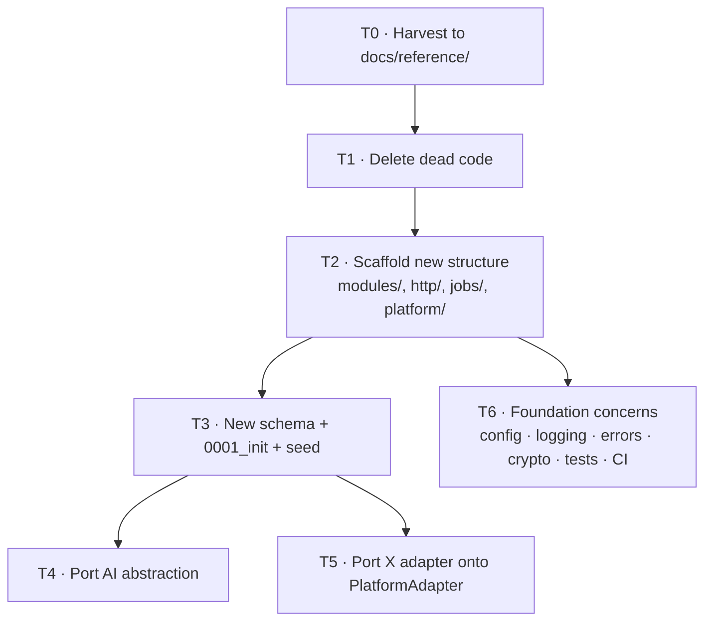

# 03 — Teardown plan

> **Decision:** clean foundation reset. New schema, new app structure; port only the AI
> provider abstraction and the publisher clients.
> See [ADR-0001](./adr/0001-clean-foundation-reset.md).

No production data and no real users exist, so this is a rewrite in place rather than a
migration. The repo, git history, and the `Buzzalicious` name are kept.

## Inventory

### Backend — `backend/src/`

| File | Lines | Disposition | Rationale |
|------|-------|-------------|-----------|
| `routes/social.routes.ts` | 845 | **Delete, harvest** | OAuth flows for X/LinkedIn/Canva plus posting plus routing in one file. The OAuth handshake sequences are worth reading while writing the new adapters; the file itself is not salvageable. |
| `routes/ai.routes.ts` | 272 | **Delete** | Generic prompt→content endpoints. The new surface is template- and brand-driven, not free-prompt. |
| `routes/schedule.routes.ts` | 142 | **Delete, harvest** | Scheduling CRUD shape is a useful reference for the new calendar endpoints. |
| `services/ai/types.ts` | 43 | **Port** | Clean provider-agnostic interface. Extend with a `purpose` concept and structured-output support. |
| `services/ai/factory.ts` | — | **Port** | Provider selection. Add fallback/retry across providers. |
| `services/ai/openai.service.ts` | — | **Port** | Keep text generation. Drop image generation — Satori replaces it. |
| `services/ai/gemini.service.ts` | — | **Port** | Same. |
| `services/twitter.service.ts` | 111 | **Port, rewrite** | Working OAuth 1.0a + posting against `twitter-api-v2`. Becomes the `X` `PlatformAdapter`, gaining media upload and metrics. |
| `services/linkedin.service.ts` | 116 | **Park** | LinkedIn drops to P1. Keep the file on a reference branch or in `docs/reference/`; do not carry it into the new `modules/publish/`. |
| `services/canva.service.ts` | 299 | **Delete** | Superseded by the Satori pipeline ([ADR-0002](./adr/0002-satori-template-rendering.md)). Remove the OAuth flow and all `canva*` columns. |
| `services/scheduler.service.ts` | 155 | **Delete** | `setInterval` polling with no locking, no retry, no backoff, and hardcoded two-platform branching. pg-boss replaces it wholesale. |
| `auth.ts` | 94 | **Port, rewrite** | Google OAuth strategy is fine. Must additionally create a `Workspace` + `Membership` on first login. |
| `middleware/auth.ts` | 8 | **Rewrite** | Needs brand-scoping and authorization, not just an `isAuthenticated` boolean. |
| `index.ts` | 178 | **Rewrite** | Becomes thin bootstrap: config validation, middleware, router mounting, worker start, graceful shutdown. Business logic moves out. |
| `db.ts` | 7 | **Port** | Add the token-encryption Prisma extension. |

### Frontend — `frontend/src/`

| File | Lines | Disposition | Rationale |
|------|-------|-------------|-----------|
| `components/AIGenerator.tsx` | 796 | **Delete** | The old product's centerpiece: a prompt box. The new centerpiece is a template composer. |
| `components/Analytics.tsx` | 215 | **Delete** | Displays AI token cost and provider latency — developer telemetry mislabeled as analytics. The new Insights view is about post outcomes. |
| `components/Profile.tsx` | 400 | **Delete, harvest** | Social-account connect/disconnect UX is a useful reference for the new Brand settings screen. |
| `components/ScheduledPosts.tsx` | 231 | **Delete, harvest** | Same for the calendar view. |
| `App.tsx` | 145 | **Rewrite** | Tab-state navigation replaced by React Router; add an auth guard and a brand switcher. |
| `App.css` / component CSS | — | **Delete** | Replaced by a design system. See [open questions](./09-open-questions.md). |
| `utils/api.ts` | — | **Rewrite** | Becomes a typed client layered under TanStack Query. |
| `logo.png`, `favicon_*.png` | — | **Keep** | Branding survives. |

### Database

| Item | Disposition |
|------|-------------|
| All 14 migrations in `backend/prisma/migrations/` | **Delete** — replaced by a single `0001_init` |
| `backend/migrate-social-data.sql` | **Delete** — one-off script for a schema that won't exist |
| `backend/prisma/schema.prisma` | **Rewrite** per [02](./02-data-model.md) |
| `backend/prisma/seed.ts` | **Rewrite** — taxonomy, templates, demo brands |
| Dev/prod databases | **Drop and recreate** |

### Root docs

| File | Disposition |
|------|-------------|
| `README.md` | **Rewrite** — currently documents the old product and a stale endpoint list |
| `AI_INTEGRATION.md` | **Delete** — superseded; useful content folds into `docs/` |
| `TWITTER_INTEGRATION.md` | **Delete, harvest** — the OAuth 1.0a setup steps are worth moving into [08](./08-platform-integrations.md) |
| `Procfile` | **Rewrite or delete** — depends on the hosting decision ([09](./09-open-questions.md)) |

## Dependencies

**Remove:** any Canva-specific config, `openai` image-generation usage (keep the package
for text).

**Add:**

| Package | Purpose |
|---------|---------|
| `satori`, `@resvg/resvg-js` | Template rendering |
| `pg-boss` | Job queue and cron |
| `zod` | Config, API, and slot-schema validation |
| `pino`, `pino-http` | Structured logging |
| `@aws-sdk/client-s3` | R2 (S3-compatible) |
| `sharp` | Image preprocessing, thumbnails, format conversion |
| `vitest`, `supertest` | Testing |
| `react-router-dom`, `@tanstack/react-query` | Frontend routing and server state |
| `express-rate-limit` | Abuse protection on auth and short-link routes |

**Already installed but unused — start using:** `connect-pg-simple` (session store).

## Harvest before deleting

Do this *first*, in one commit, so the knowledge isn't lost when files are removed:

Create `docs/reference/` and move in, verbatim and clearly marked as dead code:

- The X OAuth 1.0a request-token → access-token sequence from `social.routes.ts`
- The LinkedIn OAuth + UGC post payload shape from `linkedin.service.ts`
- The scheduled-post status transitions from `scheduler.service.ts`
- Any platform-specific quirks discovered the hard way (redirect URI handling, token
  expiry behavior, the deployed-environment redirect fixes visible in git history)

## Sequence

T0 and T1 are a single PR. T2 and T6 can run in parallel with T3.

## What actually happened (M1)

T0, T1, T2, T4 and T6 landed together as M1. T3 and T5 did not, and that is deliberate:

- **T3 (schema + `0001_init` + seed)** belongs to W2, which owns
  `backend/prisma/schema.prisma` exclusively. M1 only *emptied* `prisma/migrations/`.
  The consequence is that `prisma migrate deploy` is currently inert — it runs and
  applies nothing — and local development uses `prisma db push`. The Procfile `release`
  process type is wired anyway so that W2's first migration deploys without also
  changing the release pipeline.
- **T5 (port the X adapter onto `PlatformAdapter`)** needs a `PlatformAdapter`
  interface and a resolved-credential model, neither of which exists before W6. The
  prototype's `twitter.service.ts` was moved unreferenced to
  `backend/src/modules/publish/x/` with a header stating what must change; the wire-level
  knowledge is in `docs/reference/x-oauth1a.md`.

Two further deviations worth recording:

- **pg-boss was deferred to W6.** `jobs/` and the `worker` process type are scaffolded
  and the worker boots, idles and shuts down cleanly, but no queue is registered. This
  proves the process type, config and database wiring before any real job depends on
  them, without committing to a queue API that has no jobs to run.
- **`schema.prisma` still declares `canva*`, `twitter*` and `linkedin*` columns.** No
  code reads them. Removing them is W2's job, since it rewrites the file wholesale.

## Definition of done for the teardown

- [x] `backend/src/` contains no reference to Canva, `setInterval` scheduling, or
      free-prompt AI generation — the sole surviving `setInterval` is a keep-alive in
      `worker.ts` for a process that listens on no socket
- [x] `frontend/src/components/` is empty of the four old components
- [ ] `prisma/migrations/` contains exactly one migration — **W2.** M1 emptied the
      directory; `0001_init` is W2's to author
- [x] `npm run build`, `npm run lint`, `npm run type-check`, and `npm test` all pass at
      the repo root
- [ ] The app boots, a user can sign in with Google, and a workspace + brand are
      created — boot and Google sign-in work; workspace and brand are W2/W3 models
- [x] `docs/reference/` captures the harvested integration knowledge
- [x] Root `README.md` describes the new product and setup accurately
