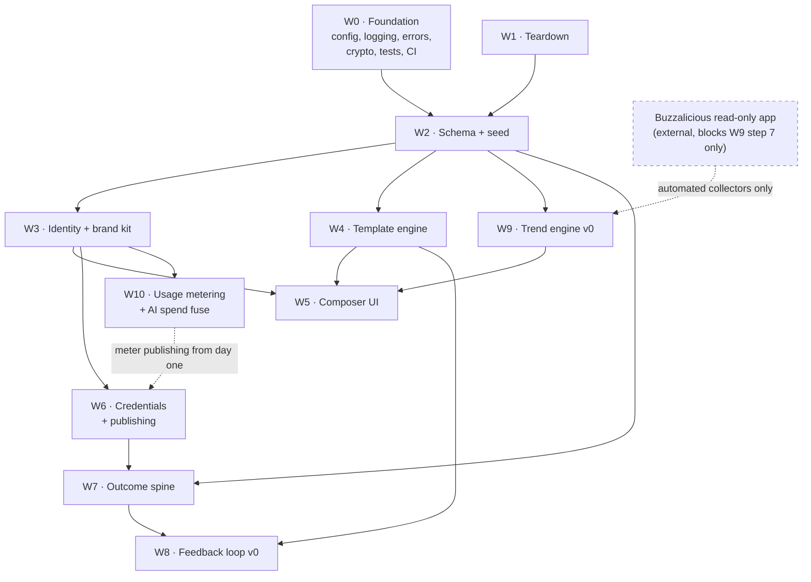

# 04 — Phase 1 roadmap

> **Status:** proposed plan. No implementation has started.

Phase 1 delivers the v1 PRD's P0 set: brand kits, a category-relevant template library,
template auto-population, per-platform export, publishing to Instagram / Facebook /
Threads / X, per-post outcome tracking, feedback loop v0, and trend engine v0.

## The critical-path insight

**Clients bring their own platform credentials** ([ADR-0009](./adr/0009-byo-platform-credentials.md)),
which removes Meta app review from the critical path for publishing. Rise & Shore and
TaxDedux are already verified and can publish as soon as the pipeline exists.

Two external tracks remain, and neither blocks the core loop:

- **A minimal Buzzalicious app for read-only trend collection** — lighter scopes, easier
  review, needed only for W9 step 7. Start it in week 1 anyway; it costs nothing to wait
  in a queue.
- **The `PLATFORM_APP` track** for future non-technical clients — deliberately off the
  phase-1 critical path.

The second-order consequence still shapes the plan: **the product must be useful before
publishing works**, because credential onboarding, capability gaps, and account
conversions all take time. Export/download and first-party short links stay P0.

## Workstreams

Each workstream has a brief in [`tasks/`](./tasks/) sized for one agent session.

| ID | Workstream | Depends on | Parallelizable |
|----|-----------|-----------|----------------|
| **W0** | Foundation & hygiene | — | yes |
| **W1** | Teardown | — | yes (with W0) |
| **W2** | Schema, migration, seed | W1 | no |
| **W3** | Identity, tenancy, brand kit | W2 | no |
| **W4** | Template engine & rendering | W2 | yes (with W3) |
| **W5** | Composer UI | W3, W4 | no |
| **W6** | Credentials, platform integrations & publishing | W2, W3 | yes |
| **W7** | Outcome spine (short links + metrics) | W2, W6 | partially |
| **W8** | Feedback loop v0 | W4, W7 | no |
| **W9** | Trend engine v0 | W2 | yes |
| **W10** | Usage metering & AI spend fuse | W2, W3 | yes (with W4, W5) |

## Milestones

### M1 — Foundation standing (W0, W1, W2)

**Exit:** the app boots on the new schema, signs a user in, creates a workspace, and
CI is green. No product features yet.

- Teardown complete per [03](./03-teardown.md)
- Zod-validated config; the process refuses to boot on missing secrets
- Pino logging with token/PII redaction; request IDs
- Typed error hierarchy and a single error middleware
- AES-256-GCM encryption for OAuth tokens at the Prisma boundary
- Postgres-backed sessions
- Flat ESLint config at the root, actually wired to both workspaces
- Vitest running, with one meaningful test per layer as a pattern
- GitHub Actions: typecheck, lint, test, build
- `0001_init` migration + seed (taxonomy, templates, demo brands)

**Risk:** foundation work is easy to under-scope and expensive to retrofit. Resist
starting W4/W5 before CI is green.

### M2 — Brand kit & template rendering (W3, W4)

**Exit:** a seeded template renders, populated with a real brand kit, into four
platform-native PNGs stored in R2 — provably, via a test.

- Brand CRUD; palette, typography, and the authored voice guide
- Business-category taxonomy selection
- Asset upload to R2, with a local filesystem driver for development
- Satori → resvg pipeline behind the `Renderer` interface
- 8–12 seed templates across 3–4 archetypes, hand-tagged by category
- Per-platform rendition specs (1:1, 4:5, 9:16, 16:9)
- Template relevance query: given a brand category, rank templates

**This is the highest-risk build in phase 1.** Font loading, text measurement, and
overflow handling in Satori are where estimates usually break. See [05](./05-template-engine.md).

### M3 — Composer & export (W5)

**Exit:** a user goes signup → brand kit → pick template → fill slots → preview all four
platforms → download. **A complete, valuable product loop with no platform API involved.**

- React Router shell, auth guard, brand switcher
- Template gallery ranked by category relevance
- Slot-filling composer with live preview per platform
- AI caption generation using the brand voice guide
- Export/download bundle

Ship M3 to Rise & Shore and TaxDedux for dogfooding even if Meta review is still pending.

### M4 — Credentials & publishing (W6)

**Exit:** a client's own credentials are onboarded, validated, and used to publish to X
and to IG/FB/Threads, with scheduling.

- `PlatformCredential` model, envelope encryption, `CredentialResolver` ([10](./10-credentials-and-security.md))
- Credential onboarding UI with **capability pre-flight** and a plain-language report
- `PlatformAdapter` interface taking a resolved credential, X implemented first
- Per-brand OAuth connect flows with signed state; proactive token refresh job
- pg-boss publish jobs with retry, backoff, and partial-failure handling
- Calendar view; schedule, reschedule, cancel

### M5 — Outcome spine (W7)

**Exit:** every published post has click data within minutes and platform metrics within
a day.

- Short-link redirector with bot filtering
- Automatic short-link injection into captions at publish time, one link per platform
- Click ingestion and rollups
- Metrics polling jobs at 1h / 24h / 7d after publish
- Insights view: per-post, per-platform, rolled up by template and trend

### M6 — Feedback loop v0 & trends (W8, W9)

**Exit:** template recommendations demonstrably differ between a brand with history and a
brand without, and the trend feed shows category-relevant trends.

- Template scoring blending category priors with brand history ([06](./06-outcome-and-feedback-loop.md))
- Recommendations surfaced in the composer with a visible "why this" explanation
- Trend collectors + scoring + category mapping ([07](./07-trend-engine.md))
- Trend feed filtered to the brand's category, usable as a composer entry point

## Sequencing guidance for agent sessions

- **One workstream per session.** These briefs are sized so an agent can hold the whole
  context.
- **W0/W1 must land before anything else merges.** Everything downstream assumes the new
  structure.
- **W4 and W9 are the two genuinely parallel tracks** after M1 — different modules, no
  shared files.
- **Never let two sessions touch `schema.prisma` simultaneously.** Schema changes
  serialize through W2's owner.
- **Update the relevant doc in the same PR as the code.** These docs are the contract.

## Explicitly deferred

Do not build these in phase 1, but do not design them out:

- LinkedIn and TikTok publishing (P1 — the adapter interface makes them additive)
- Persona layers (P1 — modeled in the schema, no UI)
- A/B variants (P1 — `variantGroupId` exists in the schema)
- Best time to post (P1)
- Video, motion graphics, demo capture, agency mode, marketplace (v2/v3)

## What "phase 1 is done" means

1. Rise & Shore and TaxDedux both run entirely on the platform
2. A post goes idea → published → measured without leaving the app
3. Template suggestions for the two brands differ from each other and from a cold-start brand
4. The team can answer "which template drove the most link clicks last month" from the UI
