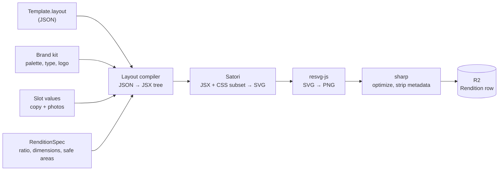

# 05 — Template engine

> **Status:** proposed. The highest-risk build in phase 1.
> **Decision:** HTML/CSS → Satori → resvg → PNG, rendered server-side.
> See [ADR-0002](./adr/0002-satori-template-rendering.md).

## What a template actually is

The v1 PRD says: *"auto-populate a selected template with the user's own photos, copy, and
brand kit"* and *"export in the correct format per platform."* Unpacked, a template is
three things:

1. **A slot schema** — the typed inputs a user must supply (a headline, two photos, a
   price).
2. **A layout** — a parameterized visual arrangement that consumes slots plus the brand
   kit.
3. **Category relevance metadata** — which kinds of business this template is for. This is
   the wedge; without it we are Predis.ai.

A template is *not* a fixed image with text holes punched in it. It is a function:

```
render(template, brandKit, slotValues, aspectRatio) → PNG
```

## Pipeline



Satori is Vercel's library behind `@vercel/og`. It implements a subset of flexbox and CSS
against a JSX-shaped element tree, producing SVG with **no browser involved**. resvg-js
rasterizes to PNG via Rust bindings.

### Why not Puppeteer

| | Satori + resvg | Puppeteer |
|---|---|---|
| Cold start | none | 300ms–2s Chromium boot |
| Per render | ~10–50ms | ~200–800ms |
| Memory | ~50–100MB | 300MB+ per instance |
| Container | plain Node image | Chromium + system libs |
| CSS support | flexbox subset, no grid, no filters | everything |
| Determinism | high | font/version drift between environments |

The cost difference compounds: every post produces four renditions, and a preview
re-renders on every keystroke (debounced). Satori makes live preview feasible; Puppeteer
does not.

**The price is real:** no CSS grid, no `position: absolute` in some cases, limited
filters, no web fonts without explicitly loading font buffers. Templates must be authored
within that subset. Keep Puppeteer available as a `Renderer` implementation for a future
"complex template" tier rather than as the default.

## Layout definition

Templates are stored as JSON, not as code, so that a template editor (and eventually a
marketplace) becomes possible without shipping new builds. The compiler translates JSON
into the element tree Satori consumes.

```jsonc
{
  "version": 1,
  "canvas": { "safeArea": { "top": 0.08, "bottom": 0.12 } },
  "root": {
    "type": "stack",
    "direction": "column",
    "style": { "background": "$brand.palette.background", "padding": "$scale(48)" },
    "children": [
      {
        "type": "image",
        "source": "$slot.heroPhoto",
        "style": { "flex": 1, "objectFit": "cover", "borderRadius": "$scale(24)" }
      },
      {
        "type": "text",
        "content": "$slot.headline",
        "style": {
          "fontFamily": "$brand.typography.headingFamily",
          "fontSize": "$fit(64, 32)",
          "color": "$brand.palette.text"
        }
      },
      { "type": "logo", "style": { "width": "$scale(120)", "align": "end" } }
    ]
  }
}
```

### Binding expressions

| Prefix | Resolves to |
|--------|-------------|
| `$brand.*` | Brand kit values — palette, typography, logo asset |
| `$slot.*` | User-supplied slot values, validated against `slotSchema` |
| `$scale(n)` | A dimension scaled proportionally to the target rendition |
| `$fit(max, min)` | Font size auto-fitted between bounds to avoid overflow |

`$scale` and `$fit` are what make **one layout serve four aspect ratios**. Without them,
each ratio needs a hand-authored variant — four times the template authoring cost and the
main reason competitors' "one-click resize" output looks broken.

### Slot schema

```jsonc
{
  "headline":  { "type": "text",  "maxLength": 60, "required": true,
                 "aiHint": "punchy hook, brand voice" },
  "body":      { "type": "text",  "maxLength": 140, "required": false },
  "heroPhoto": { "type": "image", "minWidth": 1080, "required": true,
                 "aspectHint": "4:5" },
  "cta":       { "type": "text",  "maxLength": 24, "required": false,
                 "default": "Learn more" }
}
```

Validated with Zod at the API boundary. `aiHint` feeds caption generation so the AI knows
what each slot is *for* — the difference between a generic caption and one that fits the
layout.

## Per-platform rendition specs

| Ratio | Pixels | Used by |
|-------|--------|---------|
| `SQUARE_1_1` | 1080×1080 | Instagram feed, Facebook, Threads |
| `PORTRAIT_4_5` | 1080×1350 | Instagram feed (max real estate) |
| `STORY_9_16` | 1080×1920 | Instagram Stories/Reels, future TikTok |
| `LANDSCAPE_16_9` | 1200×675 | X, future LinkedIn |

**Safe areas matter.** Instagram Stories overlay UI on the top ~8% and bottom ~12%.
Rendering the same layout without accounting for that puts the CTA under the platform's
own chrome. `canvas.safeArea` is per-ratio and enforced by the compiler — this is what
"native quality per platform" means concretely.

## Fonts

The most common Satori failure mode. Rules:

- Fonts are **explicitly loaded as buffers** and passed to Satori. No web fonts, no system
  font fallback.
- Ship a curated set (4–6 families × 2–3 weights) as `AssetKind.FONT`, cached in memory at
  worker start.
- **Every glyph used must exist in the loaded font.** Emoji need a separate emoji font or
  an image-substitution strategy — Satori supports a `graphemeImages` map. Small business
  captions are full of emoji; this will surface immediately.
- Custom brand font upload is post-v1, but the model (`AssetKind.FONT`) already allows it.

## Seed template set

8–12 templates across archetypes that generalize across business categories, each
hand-tagged with category weights:

| Archetype | Example use | Strong categories |
|-----------|-------------|-------------------|
| `stat-callout` | "73% of small businesses overpay" | professional services, finance |
| `tip-list` | "3 things to check before filing" | services, education |
| `before-after` | Split photo | trades, beauty, fitness, hospitality |
| `testimonial` | Quote + attribution | all |
| `product-feature` | Photo + name + price | retail, food & beverage |
| `announcement` | Event, hours, opening | all, especially local |
| `question-hook` | Engagement prompt | all |
| `behind-the-scenes` | Photo-led, light text | hospitality, trades |

Tagging 8 templates × ~60 categories by hand is tractable in an afternoon and is a
**category-parent-level** exercise: tag against the ~8 parents, inherit to leaves, then
override the exceptions.

## Performance targets

| Operation | Target |
|-----------|--------|
| Single rendition | < 300ms p95 |
| Four renditions (one post) | < 1s p95 |
| Live preview (debounced, low-res) | < 150ms |

Previews render at reduced resolution and only rasterize to PNG on export/publish. Cache
renditions keyed by `(templateId, templateVersion, brandId, hash(slotValues), ratio)` so
re-publishing or reopening a post is free.

## Risks

| Risk | Mitigation |
|------|-----------|
| Satori's CSS subset can't express a desired design | Author templates within the subset from the start; validate the seed set *before* building the composer UI |
| Text overflow at long input or small ratios | `$fit` auto-sizing plus `maxLength` in the slot schema; render-time overflow detection that fails loudly |
| User photos have wrong aspect/resolution | `sharp` preprocessing with smart crop; `aspectHint` guides upload UI |
| Emoji rendering | Decide the emoji strategy during W4, not after |
| Template versioning corrupting attribution | `Post.templateVersion` is written at creation; layout changes bump the version |

## Build order for W4

1. `Renderer` interface + Satori implementation for **one hardcoded template, one ratio**
2. Font loading and caching
3. Layout compiler: JSON → element tree, with `$brand` / `$slot` binding
4. `$scale` / `$fit` responsive primitives + multi-ratio output
5. Safe-area enforcement per ratio
6. R2 storage + `Rendition` persistence + cache key
7. Author the remaining seed templates
8. Category tagging + the relevance ranking query

**Stop after step 1 and look at the output.** If the visual quality isn't there, the whole
approach needs to be revisited before another 7 steps are spent on it.
