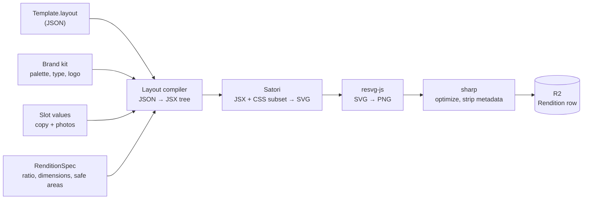

# 05 — Template engine

> **Status:** implemented (W4). The highest-risk build in phase 1.
> **Decision:** HTML/CSS → Satori → resvg → PNG, rendered server-side.
> See [ADR-0002](./adr/0002-satori-template-rendering.md).
>
> Two questions this document left open were resolved during the build and are recorded
> below: **safe areas** are layered (platform default → template → per-ratio override),
> and **emoji** (Q9) render as vendored Twemoji images.

## What a template actually is

The v1 PRD says: *"auto-populate a selected template with the user's own photos, copy, and
brand kit"* and *"export in the correct format per platform."* Unpacked, a template is
three things:

1. **A slot schema** — the typed inputs a user must supply (a headline, two photos, a
   price).
2. **A layout** — a parameterized visual arrangement that consumes slots plus the brand
   kit.
3. **Category relevance metadata** — which kinds of business this template is for. This is
   the wedge; without it we are Predis.ai.

A template is *not* a fixed image with text holes punched in it. It is a function:

```
render(template, brandKit, slotValues, aspectRatio) → PNG
```

## Pipeline



Satori is Vercel's library behind `@vercel/og`. It implements a subset of flexbox and CSS
against a JSX-shaped element tree, producing SVG with **no browser involved**. resvg-js
rasterizes to PNG via Rust bindings.

### Why not Puppeteer

| | Satori + resvg | Puppeteer |
|---|---|---|
| Cold start | none | 300ms–2s Chromium boot |
| Per render | ~10–50ms | ~200–800ms |
| Memory | ~50–100MB | 300MB+ per instance |
| Container | plain Node image | Chromium + system libs |
| CSS support | flexbox subset, no grid, no filters | everything |
| Determinism | high | font/version drift between environments |

The cost difference compounds: every post produces four renditions, and a preview
re-renders on every keystroke (debounced). Satori makes live preview feasible; Puppeteer
does not.

**The price is real:** no CSS grid, no `position: absolute` in some cases, limited
filters, no web fonts without explicitly loading font buffers. Templates must be authored
within that subset. Keep Puppeteer available as a `Renderer` implementation for a future
"complex template" tier rather than as the default.

## Layout definition

Templates are stored as JSON, not as code, so that a template editor (and eventually a
marketplace) becomes possible without shipping new builds. The compiler translates JSON
into the element tree Satori consumes.

```jsonc
{
  "version": 1,
  "canvas": {
    // Applies to every ratio. Optional — most templates need nothing here.
    "safeArea": { "left": 0.04, "right": 0.04 },
    // Per-ratio overrides, merged over the flat value one edge at a time.
    "byRatio": { "LANDSCAPE_16_9": { "left": 0.08, "right": 0.08 } }
  },
  "root": {
    "type": "stack",
    "direction": "column",
    "style": { "background": "$brand.palette.background", "padding": "$scale(48)" },
    "children": [
      {
        "type": "image",
        "source": "$slot.heroPhoto",
        "style": { "flex": 1, "objectFit": "cover", "borderRadius": "$scale(24)" }
      },
      {
        "type": "text",
        "content": "$slot.headline",
        "style": {
          "fontFamily": "$brand.typography.headingFamily",
          "fontSize": "$fit(64, 32)",
          "color": "$brand.palette.text"
        }
      },
      { "type": "logo", "style": { "width": "$scale(120)", "align": "end" } }
    ]
  }
}
```

### Binding expressions

| Prefix | Resolves to |
|--------|-------------|
| `$brand.*` | Brand kit values — palette, typography, logo asset |
| `$slot.*` | User-supplied slot values, validated against `slotSchema` |
| `$scale(n)` | A dimension scaled proportionally to the target rendition |
| `$fit(max, min)` | Font size auto-fitted between bounds to avoid overflow |

`$scale` and `$fit` are what make **one layout serve four aspect ratios**. Without them,
each ratio needs a hand-authored variant — four times the template authoring cost and the
main reason competitors' "one-click resize" output looks broken.

### Slot schema

```jsonc
{
  "headline":  { "type": "text",  "maxLength": 60, "required": true,
                 "aiHint": "punchy hook, brand voice" },
  "body":      { "type": "text",  "maxLength": 140, "required": false },
  "heroPhoto": { "type": "image", "minWidth": 1080, "required": true,
                 "aspectHint": "4:5" },
  "cta":       { "type": "text",  "maxLength": 24, "required": false,
                 "default": "Learn more" }
}
```

Validated with Zod at the API boundary. `aiHint` feeds caption generation so the AI knows
what each slot is *for* — the difference between a generic caption and one that fits the
layout.

## Per-platform rendition specs

| Ratio | Pixels | Used by |
|-------|--------|---------|
| `SQUARE_1_1` | 1080×1080 | Instagram feed, Facebook, Threads |
| `PORTRAIT_4_5` | 1080×1350 | Instagram feed (max real estate) |
| `STORY_9_16` | 1080×1920 | Instagram Stories/Reels, future TikTok |
| `LANDSCAPE_16_9` | 1200×675 | X, future LinkedIn |

### Safe areas

**Decided in W4.** An earlier draft of this document described safe areas as per-ratio in
prose and showed a single flat `safeArea` in the worked example. W2 had to seed templates
against that and hedged by accepting both. This is the resolution.

The effective safe area for a render is built in three layers, **merged per edge**, later
winning:

```
PLATFORM_DEFAULT[ratio]  ⊕  canvas.safeArea  ⊕  canvas.byRatio[ratio]
```

| Layer | Owned by | Purpose |
|-------|----------|---------|
| `PLATFORM_DEFAULT[ratio]` | the renderer | Chrome the platform imposes, that no template author should have to remember |
| `canvas.safeArea` | the template | The design's own margin, at every ratio |
| `canvas.byRatio[ratio]` | the template | The exception, for the one ratio that needs it |

Only `STORY_9_16` has a platform default — `{ top: 0.08, bottom: 0.12 }`, for the Stories
overlay. Every other ratio defaults to nothing.

**Why not flat-only.** A single flat safe area has to be conservative enough for the
tightest ratio. The tightest ratio is 9:16, so every 1:1 and 16:9 render would give up 20%
of its canvas to chrome that is not there. That is not a small tax on a format whose whole
job is to be visually dense.

**Why not per-ratio-only.** The expensive half of per-ratio safe areas is authoring: four
numbers per template per ratio, most of them identical, all of them able to drift. Pushing
that onto every template author to serve one ratio is the wrong trade.

Layering gets both: the renderer knows the Stories overlay, so no author has to; authors
write one margin; and the template that genuinely needs a different inset at 16:9 can say
so without restating the other three.

**What `byRatio` is keyed on, and what it actually means.** Chrome is a property of the
*surface* — Instagram Stories — not of the 9:16 aspect ratio. The two are being conflated
here deliberately, because `Rendition` hangs off `Post` rather than `PostTarget` (one
render per ratio, shared by every platform using it), so **ratio is the only key
available at render time**. The consequence is real and worth stating: a 9:16 rendition
used somewhere without an overlay — a TikTok upload, a download — wastes the top 8% and
bottom 12%. That is the accepted cost of not re-rendering per destination. If a future
surface needs 9:16 without the inset, the key has to become the surface, and that is a
schema change, not a tuning change.

This is what "native quality per platform" means concretely: enforced by the compiler,
with an ink-level test asserting that nothing is drawn in the Stories bands.

## Fonts

The most common Satori failure mode, and it earned the reputation. Rules:

- Fonts are **explicitly loaded as buffers** and passed to Satori. No web fonts, no system
  font fallback.
- Fonts are **committed to the repository** under `backend/assets/fonts/`, vendored by
  `npm run fonts:vendor`. Heroku's filesystem is ephemeral and a render must not depend on
  a network fetch (ADR-0002 requires determinism; docs/12 forbids network in tests).
- **Every glyph used must exist in a loaded font**, or the render fails loudly. See
  *Emoji* below for the one exception.
- Custom brand font upload is post-v1, but the model (`AssetKind.FONT`) already allows it.

### The curated set

Defined in `backend/src/modules/render/fonts.ts` as `CURATED_FONTS`, which is the
importable contract W3's typography picker consumes. Five families, all **SIL OFL 1.1**:

| Family | Role | Weights | Why it is here |
|--------|------|---------|----------------|
| Inter | both | 400, 600, 700, 800 | Neutral workhorse; the default body face |
| Fraunces | heading | 400, 600, 700, 900 | Warm high-contrast serif for hospitality and food |
| Playfair Display | heading | 400, 700, 800 | Editorial serif for beauty and professional services |
| Space Grotesk | both | 400, 500, 700 | Geometric sans with character, for trades and fitness |
| Bebas Neue | heading | 400 | Condensed all-caps display, for stat callouts and offers |

Fifteen files per subset, thirty in total (~830KB), loaded once per process and cached.
Weights are **not synthesized** by Satori: an unshipped weight silently renders as
whichever face the family does have, so `nearestWeight()` snaps deliberately rather than
letting it happen by accident.

Font *licensing* generally is open question Q19 and is not W4's to settle. What W4 can
say: nothing in this set is licence-encumbered. All five are OFL, which permits
embedding, redistribution and server-side rasterization without attribution in the output.
A test asserts the licence field, so adding an encumbered family fails CI rather than
quietly shipping.

### Three Satori font traps, all of which cost real time

Each is commented at the code that guards it. Repeating them here because each one is the
kind of thing that gets "cleaned up" by a well-meaning later change.

**1. Variable fonts crash the renderer.** Satori parses fonts with a bundled fork of
opentype.js that throws on the `fvar` table every variable TTF Google Fonts ships. Not a
wrong render — a dead renderer. The vendored files are **per-weight static WOFF**. Do not
"upgrade" them to upstream Google TTFs.

**2. Google's `latin-ext` subset is complementary, not a superset.** `latin` covers
U+0000–00FF; `latin-ext` *starts* at U+0100. A font built from `latin-ext` alone renders
every ASCII character as a box. The first vendoring did exactly this and produced a page
of tofu. Both subsets ship, per weight.

**3. Registering both subsets under one family name silently drops half of them.** Satori
resolves a text run to a single face per family, so with `latin` and `latin-ext` both
named `"Inter"`, `Łódź` renders as a NO GLYPH box followed by `ódź`. The subsets are
registered as **distinct families** — `Inter` and `Inter Ext` — joined by a CSS fallback
list. Family names containing a space **must be quoted**, or they resolve to nothing.

### Text measurement

Satori does not expose measurement, so `$fit` needs its own. Parsing ~830KB of font per
binary-search step is not viable, so `npm run fonts:vendor` also generates
`assets/fonts/metrics.json` (~100KB): per-family coverage ranges and per-weight advance
widths in font units. The render path never opens a font file to measure.

Kerning is ignored. `SAFETY_MARGIN` (1.015) covers the difference and errs toward
*declaring* overflow — the failure this system must not have is text that silently fits in
the measurement and clips in the render.

## Emoji

**Decided in W4, resolving Q9.** Emoji are rendered as **images**, from a vendored copy of
Twemoji, through Satori's `loadAdditionalAsset` hook.

Rejected alternatives:

- **A colour emoji font.** Satori cannot draw CBDT, sbix or COLR tables. Emoji would come
  out monochrome or not at all.
- **Fetching Twemoji from a CDN at render time.** Breaks determinism (ADR-0002), breaks
  docs/12's no-network rule for tests, and puts a network round trip inside a 300ms budget.

The assets are vendored offline by `npm run emoji:vendor` at a pinned tag into a single
1.8MB gzipped bundle, `backend/assets/emoji/twemoji.json.gz`.

**Supply-chain note.** `twitter/twemoji` is archived; the maintained continuation is
`jdecked/twemoji`. Of the npm packages: `@twemoji/api` is the genuine continuation but
ships **no SVG assets**, and `@twemoji/svg` is an **unaffiliated repackage** that
relicenses the artwork as MIT. Neither is used. The bundle is built from the `jdecked`
GitHub release tarball.

**Attribution.** The Twemoji graphics are **CC-BY 4.0** and require attribution;
the code is MIT. `backend/assets/emoji/NOTICE.md` carries it, and the attribution
obligation needs to be reflected in the product's public-facing credits before launch.

**One detail that fails silently if you get it wrong:** Twemoji filenames **drop U+FE0F**
(the variation selector) but **keep U+200D** (zero-width joiner). Handling those the same
way makes most common emoji resolve to nothing and vanish from the image without an error.

### When text cannot be drawn at all

A character that no loaded font covers and that is not an emoji is a **loud failure**:
`UnrenderableTextError`, naming the slot and the offending characters. Satori would
otherwise draw a filled box and return success — a 200, a PNG in storage and a `Rendition`
row, for an image with a hole in it.

This is the same reasoning as overflow, and it has a known consequence: the curated set is
Latin-only, so CJK input is rejected rather than mangled. That is the correct v1 behaviour
— an honest error beats a wall of boxes — but it means **non-Latin scripts are a font-set
question, not a renderer question**, whenever they become a requirement.

## Seed template set

8–12 templates across archetypes that generalize across business categories, each
hand-tagged with category weights:

| Archetype | Example use | Strong categories |
|-----------|-------------|-------------------|
| `stat-callout` | "73% of small businesses overpay" | professional services, finance |
| `tip-list` | "3 things to check before filing" | services, education |
| `before-after` | Split photo | trades, beauty, fitness, hospitality |
| `testimonial` | Quote + attribution | all |
| `product-feature` | Photo + name + price | retail, food & beverage |
| `announcement` | Event, hours, opening | all, especially local |
| `question-hook` | Engagement prompt | all |
| `behind-the-scenes` | Photo-led, light text | hospitality, trades |

Tagging 8 templates × ~60 categories by hand is tractable in an afternoon and is a
**category-parent-level** exercise: tag against the ~8 parents, inherit to leaves, then
override the exceptions.

### Not every template supports every ratio

`Template.supportedRatios` is a real constraint, not bookkeeping. Verifying the seeded set
at **worst-case input** — every text slot filled to its own `maxLength`, at all four
ratios — found three templates that cannot fit their declared maximum at 16:9, where
1200×675 leaves 675px of height before safe areas:

- `five-step-checklist` (already portrait and story only)
- `testimonial-quote`
- `question-hook`

The alternative was lowering their `$fit` minimums until the text fit. That was rejected:
a 24px pull quote is not a smaller version of the design, it is a different and worse one,
and shipping it would make the acceptance test pass while making the product worse. The
two remaining templates declare portrait and story support only.

**This is the expected shape of the answer, not a defect.** A layout tuned for a tall
canvas does not always have a good landscape form, and saying so in `supportedRatios` is
more honest than rendering something unusable. The ranking query filters on it, so a
composer asking for 16:9 is never offered a template that cannot do it.

## Performance targets

| Operation | Target |
|-----------|--------|
| Single rendition | < 300ms p95 |
| Four renditions (one post) | < 1s p95 |
| Live preview (debounced, low-res) | < 150ms |

Measured on a developer machine at implementation time: single rendition p50 ~110ms, p95
~135ms; four ratios in parallel p95 ~470ms; compile-and-fit without rasterizing, <1ms. The
first render in a fresh process additionally pays ~300ms of one-time Satori and resvg
initialisation, which is why the worker dyno must not sleep (ADR/hosting note in AGENTS).

These are asserted in `render.perf.test.ts`, strictly on a developer machine and
**report-only under CI** — a wall-clock threshold on a shared runner is a flake, and a
perf test people learn to re-run past is worse than none.

Previews render at reduced resolution, return **SVG**, and store nothing — a composer
preview fires on every debounced keystroke, and rasterizing and persisting each one would
be the most expensive thing the platform does for an artefact discarded milliseconds
later.

Cache renditions keyed by `(templateId, templateVersion, brandId, hash(slotValues),
ratio)` so re-publishing or reopening a post is free. **Platform is deliberately not in
the key**: `Rendition` hangs off `Post`, so one render per ratio is shared by every
platform using that ratio. The cache also confirms the object still exists in storage
before reusing a row — a `Rendition` whose object is gone is worse than no row, because
publishing would hand the platform a dead key.

## Risks

| Risk | Mitigation |
|------|-----------|
| Satori's CSS subset can't express a desired design | Author templates within the subset from the start; validate the seed set *before* building the composer UI |
| Text overflow at long input or small ratios | `$fit` auto-sizing plus `maxLength` in the slot schema; render-time overflow detection that fails loudly. Acceptance-tested at `maxLength` across every supported ratio, which is what found the three landscape-incapable templates |
| User photos have wrong aspect/resolution | `sharp` preprocessing with smart crop; `aspectHint` guides upload UI |
| Emoji rendering | **Decided** — vendored Twemoji SVGs via `loadAdditionalAsset`; see *Emoji* above |
| Template versioning corrupting attribution | `Post.templateVersion` is written at creation; layout changes bump the version |

## Build order for W4 — complete

1. ✅ `Renderer` interface + Satori implementation for **one hardcoded template, one ratio**
2. ✅ Font loading and caching
3. ✅ Layout compiler: JSON → element tree, with `$brand` / `$slot` binding
4. ✅ `$scale` / `$fit` responsive primitives + multi-ratio output
5. ✅ Safe-area enforcement, layered (see *Safe areas*)
6. ✅ R2 storage + `Rendition` persistence + cache key
7. ✅ Verify the seeded templates across all four ratios
8. ✅ Category tagging + the relevance ranking query

**Stop after step 1 and look at the output.** This gate was taken as written: step 1
produced a PNG that was reviewed before anything else was built. It was worth it — the
first output was 100% tofu, and the two font bugs behind it (traps 2 and 3 above) would
have been far more expensive to find with seven more steps built on top.

## Where this lives

| Path | Owns |
|------|------|
| `modules/render/fonts.ts` | Curated set, metrics, Satori family naming — **W3 imports this** |
| `modules/render/emoji.ts` | Twemoji lookup and the `loadAdditionalAsset` hook |
| `modules/render/measure.ts` | Text measurement, wrapping, `$fit` binary search |
| `modules/render/safe-area.ts` | The three-layer merge |
| `modules/render/bindings.ts` | `$brand` / `$slot` / `$scale` / `$fit` resolution |
| `modules/render/compile.ts` | Layout JSON → Satori element tree |
| `modules/render/render.service.ts` | Orchestration, cache, storage, `Rendition` rows |
| `modules/template/relevance.ts` | Industry-relevance ranking |
| `http/routes/templates.routes.ts` | Registry and preview endpoints |
| `scripts/vendor-fonts.ts`, `scripts/vendor-emoji.ts` | Offline asset vendoring |
