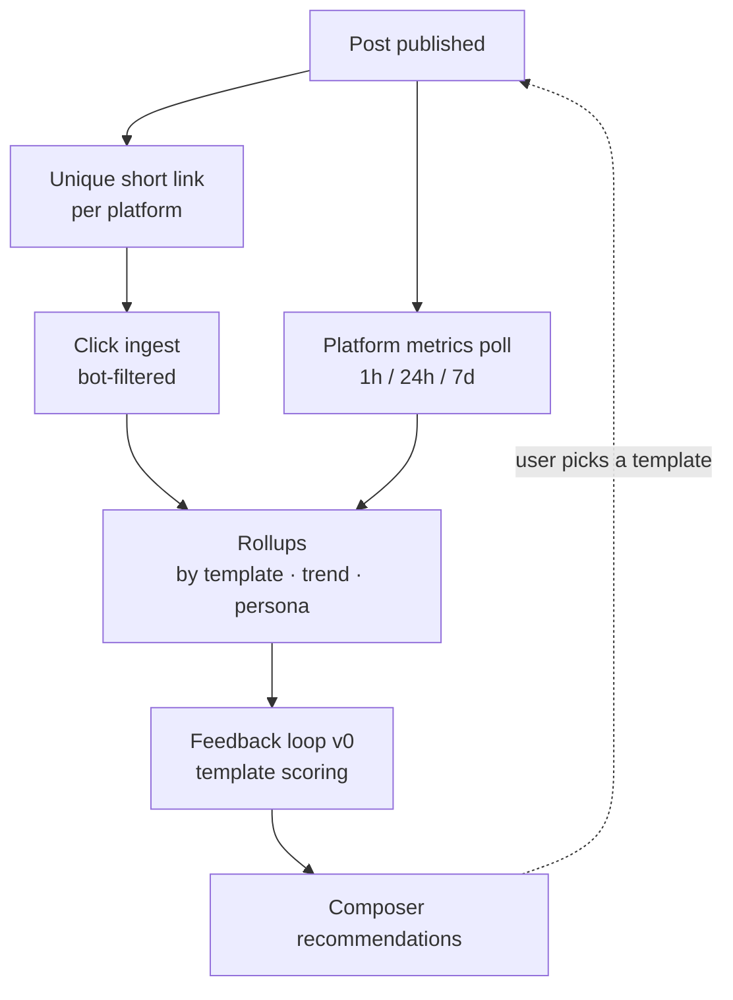

# 06 — Outcome tracking & the feedback loop

> **Status:** proposed.
> **Decision:** first-party short-link tracking is P0.
> See [ADR-0006](./adr/0006-first-party-link-tracking.md).

This is the differentiator. Every competitor optimizes toward engagement; the PRD commits
to optimizing toward **outcomes a small business actually cares about — clicks, saves,
leads.**

## The core insight

Platform metrics are *borrowed* — gated behind app review, rate limits, changing policies,
and in X's case a paid tier. Outcome metrics can be **owned**.

A first-party short-link redirector gives us, on day one and with no third-party
dependency:

- click counts per post **and per platform**
- referrer, device, geography, and time-to-click
- a durable identity we can extend into conversion tracking later

This inverts the usual dependency. Instead of *"we can't show analytics until Meta
approves us,"* we ship a working create → publish → measure loop immediately and treat
platform-native metrics as **enrichment** on top of a first-party spine.

It is also strictly better product: a small business owner comparing "1,200 impressions"
against "38 people clicked through to your booking page" cares about the second number.



## Short-link service

### Behavior

- Slug: 7 chars, base62, collision-checked. Short enough not to eat X's character budget.
- Served from the main app at `/s/:slug`. A dedicated short domain is a later, cheap
  upgrade — the route is what matters now.
- **One short link per `(post, platform)`**, not per post. This is the entire mechanism
  for per-platform attribution: identical content on Instagram vs. X produces two
  distinguishable click streams.
- `302` redirect, not `301` — permanent redirects get cached by browsers and we stop
  seeing repeat clicks.
- Injected into captions automatically at publish time, replacing a `{{link}}` marker in
  the composed copy.

### Bot filtering is not optional

Every platform fetches a link preview the instant a post goes live. Unfiltered, those hits
arrive as clicks — often several per post, before a single human sees it. Since the entire
feedback loop is built on click data, **unfiltered bot traffic would actively teach the
recommender the wrong thing.**

Layered defense:

1. User-agent matching against a known crawler list (`facebookexternalhit`, `Twitterbot`,
   `LinkedInBot`, `Slackbot`, headless signatures)
2. Discard `HEAD` requests and requests that don't accept HTML
3. Suppress clicks arriving within a few seconds of publish from datacenter ranges
4. Deduplicate by `(ipHash, shortLinkId)` inside a short window

Flag rather than drop (`LinkClick.isBot`) so the filter can be tuned retroactively against
real data.

### Privacy

- **Never store raw IPs.** Salted SHA-256, with the salt rotated periodically.
- Derive country from IP at ingest, then discard the IP entirely.
- No cross-site cookies, no third-party pixels. This is genuinely privacy-preserving
  analytics and worth saying out loud in marketing.

## Platform metrics ingestion

Complements, not replaces, the first-party spine.

| When | Why |
|------|-----|
| 1 hour after publish | Early velocity — the strongest predictor of eventual reach |
| 24 hours | The standard comparison point |
| 7 days | Near-final totals |
| Weekly for 30 days | Long-tail, especially saves on Instagram |

Each poll writes a new `PostMetric` snapshot rather than mutating a total. Snapshots are
what allow "compare all posts at their 24h mark" — a mutable counter makes that
permanently impossible.

**Availability varies by platform.** Instagram exposes saves and reach through Insights;
X's metrics depend on API tier; Threads' API is newer and thinner. Null-tolerant metric
columns and a UI that hides unavailable metrics rather than showing zeros.

## Outcome scoring

Raw metrics aren't comparable across platforms — an Instagram like and an X like are not
the same event. Normalize into a single per-post **outcome score**.

**As built (W8), this deviates from the formula below in two ways.** Both were forced by
production data; the reasoning is recorded here because the naive version is the one a
future reader will reach for first.

### The denominator is `impressions`, not `reach`

The Threads adapter (`threads.adapter.ts`) and the X adapter (`x.adapter.ts`) both
hard-code `reach: null` — neither API returns it. Dividing by `reach` would therefore null
**all four components for every X and Threads post**, and a nulled component is
indistinguishable downstream from a measured zero. The loop would have concluded that X
does not work, confidently, from an absence of data rather than a presence of failure.

`impressions` is available on all four platforms and answers the same question.

### Components are imputed, not coverage-divided

```
rate(component)  = component / impressions
value(component) = rate / median(rate) over (brand, platform, component)
score            = Σ w_i · (value_i if measured else 1.0)
```

`1.0` means "typical for this brand on this platform". The weights are unchanged:

| Signal | Weight |
|--------|--------|
| Link clicks | 0.45 |
| Saves | 0.25 |
| Shares | 0.20 |
| Likes + comments | 0.10 |

Weights and `k` live in config, not code.

The alternative — dividing by achieved coverage — makes a post measured on one component
score that component raw, so `1 click` and `1 like` both come out at `1`. Imputing the
neutral value instead keeps every post on one scale at the cost of pulling thin posts
toward typical, which is the direction we want a thin measurement to move.

**A fully unmeasured post scores `null`, never `1.0`.** This is the one place the
imputation stops, and it is enforced by a test rather than a convention: "nothing measured"
and "measured, and it was average" must not converge on the same output.

### Coverage bias: known bias, floor in place, correction deferred

Those are the words to use. Not "damped" — the caveat gets compressed on each retelling
until "we have exploration" stands in for "we handled it", and it is not handled.

**The same root cause has now surfaced three times.** They are documented together so the
next reader sees one pattern rather than three unrelated caveats:

1. **Ranking variance.** A component that is imputed contributes exactly `1.0`, with zero
   variance. So a low-coverage archetype has a compressed score range and a high-coverage
   one has a wide range. Over-representation at the extremes is by *range*, not by mean.
2. **The imputation residual.** Imputing the neutral value is unfalsifiable by
   construction: no observation can ever contradict it, because the absence of the
   observation is the trigger.
3. **The claim bar moves with coverage.** With clicks only, `observed = 0.45x + 0.55`, so
   clearing a `1.2` floor needs a true lift of **~1.44×**; at full coverage it needs
   `1.2×`. The materiality gate is therefore stricter on exactly the posts we know least
   about. Measured, not theorised: an X post at 1.6× lift clears it (1.27) and at 1.4×
   does not (1.18), while an Instagram post at 1.4× clears it (1.40). This is a
   characterisation test, not an aspiration.

The floor in place is `RECOMMEND_MIN_SAMPLE_FOR_CLAIM`, which stops the thinnest cases
from earning a sentence at all.

**The candidate correction, recorded so a future author does not invent a worse one:**
rank archetypes *within* each platform and combine the ranks (Borda / average rank) rather
than combining scores. Ranks are invariant under monotone rescaling, so a compressed range
and a wide one contribute equally. Two caveats must travel with it: (1) coverage is not
perfectly platform-determined — a failed poll varies it per post — so within-platform
commensurability is *much closer*, not exact; (2) rank combination discards magnitude,
which matters when one archetype is enormously better rather than merely better. **Not for
v1.**

## Feedback loop v0

The PRD's P0: *"surface the user's best-performing template types, and bias future
defaults toward them."* The PRD also demands the cold-start case: *"As a brand-new user
with no performance history yet, I want useful recommendations from day one."*

Those two requirements together rule out a naive "rank by average score" — a brand with
one lucky post would get a confidently wrong recommendation.

### Shrinkage toward category priors

For brand *b* and template archetype *a*:

```
score(b, a) = ( n(b,a) · observed(b,a) + k · prior(category(b), a) ) / ( n(b,a) + k )
```

- `n(b,a)` — posts this brand published with archetype *a*
- `observed(b,a)` — mean outcome score for those posts
- `prior(c,a)` — archetype performance across all brands in category *c*, falling back to
  the hand-seeded `BusinessCategory.priors` when aggregate data is thin
- `k` — smoothing constant, start at **5** (config, not a constant)

**The seeded priors are rescaled.** `BusinessCategory.priors` is authored as weights in
`0..1`, but shrinkage consumes values on the normalised scale where `1.0` is typical. Feeding
`0..1` weights in directly would make every seeded prior *below* typical, so a cold-start
brand would be told its whole category underperforms. The seeds are therefore rescaled to
mean `1.0` before entering shrinkage. This depends on the `minSampleForClaim` gate to stay
honest: a rescaled seed is a shape, not a measurement, and must never earn a brand claim.

### Shrinkage must not launder a `null` into a number

This is the load-bearing constraint of W8, and it is enforced by the *type*, not by a
comment or a naming convention.

Shrinkage's entire job is replacing a thin measurement with a better estimate, which makes
it the one operation where "unmeasured" and "measured, then pulled hard toward the prior"
naturally converge on the same output. A group with a single thin observation shrunk 95%
toward the prior is an ordinary non-null number that passes every value assertion. It does
not misstate the value — it misstates the value's **provenance**.

So:

- `meanScore` and `scored` are unchanged — raw, unshrunk, meaning what they say.
- `shrink()` returns a branded `ShrunkScore` that is **structurally unassignable to
  `number`**, carrying `shrunkValue`, and a `basis` of `{ observed, observations, prior,
  priorSource, k }`. A caller cannot use a shrunk figure where a measured one is expected
  without saying so.
- Claims report `claimBasis`, and that field is **structural**: a lookup table keyed by the
  label supplies the number, so the label *is* the selector and the two cannot drift.

The precedent is exact and local. `effectiveCaption` exists as a named function rather than
an inline `??` precisely because the two look interchangeable and are not — and the bug it
predicted was committed twelve lines away, in `buildPublishInput`, which used
`target.caption ?? ''` and published an empty caption for every target without an override.
The caption *gate* used `effectiveCaption` correctly and approved the inherited copy; the
path that was right concealed the path that was wrong. A convention documented at the
definition site does not survive contact with a call site. A type does.

The same reasoning applies to `claimBasis`, which was originally a string literal written
beside the comparison it described. Relabelling it passed all 127 tests. A provenance field
that can be wrong about its own subject is worse than no field, because downstream believes
it.

### Why the materiality floor gates the raw value

`RECOMMEND_MIN_CLAIM_MULTIPLIER` compares the **raw** observed multiplier, not the shrunk
one, and the payload records that as `claimBasis: 'raw-observed'`.

Shrinkage pulls thin samples toward `1.0` *by design*. A `1.2` floor on the shrunk value
would therefore be a second sample-size gate wearing a materiality label: a brand with
`n = 12` and a genuine `1.3×` would lose its sentence to its thinness at the same moment
`minSampleForClaim` declared the sample ample. Two gates, two questions:

- `minSampleForClaim` — *did we see enough?*
- `minClaimMultiplier` — *was what we saw worth saying?*

The behavior this produces is exactly what the PRD describes:

| Situation | Result |
|-----------|--------|
| New brand, `n = 0` | Score equals the category prior — useful day-one recommendations |
| 2 posts | Still mostly prior; one fluke can't dominate |
| 20 posts | Brand's own history dominates; recommendations are visibly personalized |

It is ~15 lines of code, explainable to a user in one sentence, and has no training
pipeline. Start here. A learned model is only worth considering once there's meaningful
volume, and it would have to beat this baseline to justify itself.

### Surfacing it

Ranking silently is a missed opportunity. Show the reasoning:

> **Recommended for you** — *Before/After* posts drove **2.4× more link clicks** than your
> average over your last 12 posts.

**Deviation, shipped:** v1 copy says "**2.4× your average outcome**", not "2.4× more link
clicks". The multiplier is blended across up to four components, so naming a single
component would be false whenever the components disagree — and disagreeing components are
the normal case, not the edge case.

A component-specific multiplier is a real product improvement and was **considered and
priced**, not overlooked. The cost is a per-component normaliser: to say "2.4× more link
clicks" honestly, clicks must be normalised on their own, which is a second normaliser to
build, store and keep consistent with the blended one. Worth doing when the copy is shown
to be the thing limiting trust; not worth doing before that.

And for a cold-start brand:

> **Popular with coffee shops** — *Behind the Scenes* templates perform well for
> businesses like yours.

This makes the core promise legible, and it's the difference between "the tool reordered
some tiles" and "the tool is learning my business." It also produces the honest failure
mode: when the explanation looks wrong to the user, we find out early.

### Guardrails

- **Always show an escape hatch.** Never collapse the gallery to recommendations only —
  `template acceptance rate` is a success metric and requires alternatives to exist.
- **Inject exploration.** Reserve ~20% of recommendation slots for templates the brand
  hasn't tried. Pure exploitation converges on a local maximum and makes every feed look
  identical — the exact Predis.ai failure the product exists to beat.
- **Require a minimum sample** before showing a brand-specific claim. Under 5 posts with
  an archetype, show the category framing instead.

### Feedback contamination is the defining risk

If the loop counts its own suggestions as evidence of what the brand wants, it converges on
whatever it happened to suggest first — and the convergence looks exactly like learning.
Every scheduled post therefore carries a `scheduleSource` of `EXPLORATION`, `SUGGESTED` or
a genuine user choice.

**The rule is dimension-specific, and the obvious reading is backwards:**

| Signal | The question it answers | Does an exploration post count? |
|--------|-------------------------|---------------------------------|
| **Outcome** | Did this perform well? | **Yes** — that is the whole return on exploring |
| **Preference** | Did this brand *want* this? | **No** — we picked it, not them |

Excluding exploration from *outcome* would throw away the only data exploration exists to
produce. Including it in *preference* would let the system read its own suggestion back as
a user endorsement.

`SUGGESTED` is excluded from preference too: **accepting a default is not choosing.** It is
weaker evidence than an unprompted pick and stronger than nothing, and v1 does not try to
price that difference — it declines to count it.

Choices are counted **per post, not per target.** A post cross-published to four platforms
is one decision, and counting it four times would let cross-posting behaviour masquerade as
preference strength.

The test for this needs its positive control or it is vacuous: assert that an exploration
post is *excluded*, **and** that a genuine user choice *is* counted. Without the second
assertion the test passes when everything is excluded.

## Send-time and cadence learning

**Decision ([Q18](./09-open-questions.md)):** the system learns each brand's best posting
times and frequency, starting from an informed guess and iterating on outcome data.

This reuses the machinery above rather than inventing a second one — the same shrinkage
formula, the same outcome score. What differs is the dimension being scored.

### Timezone still has to be right underneath

Learning *when* to post doesn't remove the need to represent time correctly. Two things
are stored:

- `Brand.timezone` — an IANA zone (`America/New_York`), not a UTC offset. Offsets change
  twice a year; zones don't.
- `Post.scheduledAt` (UTC instant) **and** `scheduledLocal` + the zone it was intended in.

Storing only the UTC instant loses the user's intent. "Every Tuesday at 9am" silently
becomes 8am or 10am after a DST transition, and recurring schedules drift. Capturing
intent alongside the instant is cheap now and unrecoverable later — the intent was simply
never recorded.

The default timezone is guessed from the browser at brand creation and is always editable.

### Audience timezone, not business timezone

The thing that matters is when the *audience* is awake, which is not always where the
business sits. A coffee shop's audience is local; Tax Dedux's audience is national and
spread across four US zones.

Platform insights expose audience geography where available, and first-party
`LinkClick` data gives a click-time histogram for free — **we can observe when a brand's
audience actually engages without asking any platform.** That histogram is the better
signal, and it's one the borrowed-metrics competitors can't easily build.

### Time slots: start coarse

The instinct is day-of-week × hour = 168 buckets. **That is far too sparse to learn
from** — a brand posting daily takes six months to get one observation per bucket, and
most buckets stay empty forever.

Start with 8 buckets and refine only when the data supports it:

| Dimension | Initial buckets |
|-----------|-----------------|
| Day type | weekday, weekend |
| Daypart | early (5–9), midday (9–14), afternoon (14–18), evening (18–23) |

Split a bucket only once it holds enough observations to distinguish its halves. This
matters more than the scoring formula: the right granularity is what makes the learning
possible at all.

### Scoring a slot

Identical in shape to archetype scoring:

```
score(b, s) = ( n(b,s) · observed(b,s) + k · prior(category(b), s) ) / ( n(b,s) + k )
```

Cold-start priors come from three stacked sources, best available first:

1. The brand's own `LinkClick` time histogram, if any links have been clicked
2. Category priors — other brands in the same `BusinessCategory`
3. Hand-seeded platform defaults in config

So a brand with zero posts still gets a defensible suggestion, and it improves
immediately rather than after some arbitrary threshold.

### Exploration is mandatory here

More so than for templates. **A pure-exploitation scheduler posts at the first slot that
looked good and never learns anything again** — it can't, because it generates no
observations anywhere else. The first lucky slot becomes permanent.

Reserve ~20–30% of scheduled posts for deliberately under-sampled slots, and prefer slots
with high uncertainty rather than uniformly random ones. Surface this honestly: *"Trying
Thursday evening — we haven't tested that time for you yet."* Users tolerate
experimentation they were told about.

**Exploration starves without rotation, and the starvation is invisible.**

Uncertainty is `1 - brandWeight`, and `brandWeight = n / (n + k)` where `n` counts posts
the brand actually *made*. It never moves when a candidate is merely *shown*. So the most
uncertain candidate is offered, declined, and arrives at the next refresh in precisely the
state that got it offered — holding the exploration slot forever while the rest of the
under-sampled pool is never seen. Every individual recommendation looks correct.

The fix is to rotate the selection window over a caller-supplied coarse time bucket:

- **`rotation` is a required parameter, never defaulted.** A default of `0` reintroduces
  the bug silently at every call site that forgets it, which is the same class of mistake
  as the `?? ''` caption default.
- **Rotation moves only over the under-sampled candidates** (`observations <
  minSampleForClaim`), falling back to the whole pool when none are — otherwise the "an
  exploration slot appears in every result set" guarantee fails for a mature brand.
- **The offset steps by whole windows**, so consecutive buckets are disjoint and every
  candidate is reached within `ceil(n / slots)` buckets.

The bucket is the local week, computed with the same `localWeekStart` the cadence code
uses, rather than a second independent notion of "week".

### Cadence is a separate problem

Frequency doesn't have an optimum in the way timing does — it has **diminishing returns
and a fatigue cliff**, and the two look identical in the data until you cross the cliff.
Per-post engagement falling as volume rises can mean saturation, or simply that reach is
being spread thinner while total reach still grows.

So measure cadence against **total** outcome per week, not per-post average. Optimizing
per-post average pushes toward posting almost never, which scores beautifully and grows
nothing.

**This has a consequence for shrinkage that is easy to get wrong.** Scoring totals means
the prior for a band of *n* posts per week must be `n × perPost.prior`, **not `1.0`**. A
neutral prior on a *total* says "a typical week is worth one typical post", which drags
every high-frequency band downward — the system would recommend posting less by way of a
prior, while looking exactly like shrinkage working correctly. Assert it directly: a brand
posting once with a great result must not outrank a brand posting eight times well.

Two further details the tests pin down:

- **Adjacency is consecutive integer frequencies**, not consecutive entries in the observed
  band list. If a brand has tried 1, 2 and 8 posts a week, 2 and 8 are not neighbours, and
  a suggested range must not step over the untried frequencies between them.
- **The plateau window is additive, not proportional.** A neighbouring band is included
  when `total >= bestEfficiency × n - slack`, with slack of one typical post. A
  *proportional* window can never contain a smaller band, which would silently make the
  range one-sided.
- **A cross-posted post counts once.** Its targets are averaged, then posts are summed.
- **An unmeasured week is `null`, never `0`.** A week we could not measure is not a week
  that performed terribly.

Weeks start Monday from the **local** date, computed with date-only UTC arithmetic — which
has no DST, because dates do not have offsets.

Cadence recommendations should be conservative and advisory in v1 — suggest a range, never
auto-schedule into it. Getting cadence wrong is visible to a brand's real audience in a way
that a mistimed post is not.

### Guardrails

- **Quiet hours.** Never auto-schedule overnight in the audience's timezone without
  explicit opt-in, regardless of what the data says.
- **Always explain and always allow override.** A suggested time the user can't move is a
  constraint, not a recommendation.
- **Minimum sample before brand-specific claims.** Under ~5 posts in a bucket, use the
  category framing.
- **Confounding is real and should be admitted.** A post's outcome reflects its content at
  least as much as its timing, and at low volume the two can't be separated. This argues
  for conservative language — *"Tuesday mornings have worked well for you"* — rather than
  false precision like *"9:15am is your optimal time."*

### Build order

Belongs to W8, after template scoring works:

1. `Brand.timezone` + intent-preserving schedule fields (W2)
2. Click-time histogram from `LinkClick` — free once W7 lands
3. Coarse slot bucketing + slot scoring reusing the shrinkage function
4. Suggested times in the composer, with explanations
5. Exploration scheduling for under-sampled slots
6. Cadence analysis as advisory guidance
7. Bucket refinement once volume justifies it

## Insights UI (v1 scope)

Deliberately narrow — the PRD puts deeper analytics at P1.

1. **Post list** — each post with its platforms, outcome score, and link clicks
2. **Post detail** — per-platform breakdown, metric snapshots over time, the click
   timeline
3. **Template performance** — archetypes ranked by outcome score for this brand, with
   sample sizes shown
4. **What's working** — a short prose summary driven by the same scoring that powers
   recommendations

Cross-post trend views, template-vs-template comparison, and per-platform benchmarking are
P1 and build on exactly this data.

## Build order for W7/W8

1. `ShortLink` model + `/s/:slug` redirector + `LinkClick` ingest
2. Bot filtering with `isBot` flagging
3. `{{link}}` injection at publish time, one link per platform
4. Click rollup queries
5. Metrics polling jobs per platform, writing snapshots
6. Outcome score computation with configurable weights
7. Shrinkage scoring + the recommendation endpoint
8. Composer recommendations with explanations
9. Send-time slot scoring + suggested times (see above)
10. Insights UI

Steps 1–4 have **no dependency on platform API approval** and can ship during M3.
