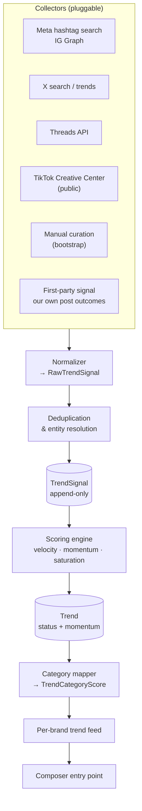

# 07 — Trend engine

> **Status:** proposed.
> **Decision:** build in-house trend detection and determination, with collectors that
> connect to social platforms automatically.
> See [ADR-0007](./adr/0007-in-house-trend-engine.md).

This is the most ambitious piece of v1 and the most defensible. Buying trend data buys a
feature; building the engine builds an asset — and the trend-relevance layer is half of
the product's differentiation ("industry-specific relevance, not generic templates").

## What "trending" means here

Crucially, the product does **not** need a global "what's trending on the internet" feed.
Those exist and are commoditized. It needs:

> *What's trending **for a business like mine**, that I could actually post about this week.*

That reframing changes the engineering problem. We are not competing with TikTok Creative
Center on breadth. We need **modest coverage with high category relevance** — a far
cheaper and more achievable target, and one nobody else is serving.

## Architecture



### Collectors

Every source implements `TrendCollector` ([01](./01-architecture.md)). Each runs on its
own pg-boss cron. A failing collector degrades the feed; it never breaks it.

| Collector | Access | Notes |
|-----------|--------|-------|
| **Manual curation** | internal admin | **Build first.** Makes the feed real on day one and validates the schema, scoring, and UI before any integration exists. |
| **First-party** | our own data | Aggregate outcome data across brands in a category. Unique to us and immune to every API risk. Grows more valuable with every user. |
| **Meta / IG hashtag search** | IG Graph API | Hashtag search is rate-limited (~30 unique hashtags per 7-day window per user) — plan a rotating watchlist, not broad discovery. |
| **X search** | X API v2 | Recent search plus trends, depending on tier. See [08](./08-platform-integrations.md). |
| **Threads** | Threads API | Newer and thinner; treat as best-effort. |
| **TikTok Creative Center** | public web | Publicly available trend data. **Confirm ToS before automating access** — see [open questions](./09-open-questions.md). |

**Build the manual collector first.** It is not a placeholder: a weekly curation pass by
someone who understands small-business marketing will outperform a naive automated feed
for months, and it is the only way to have something to score while the automated
collectors mature. It also produces the labeled data that makes category mapping tunable.

### Normalization & entity resolution

Collectors emit heterogeneous observations. The normalizer maps them to a common shape and
resolves them against existing `Trend` rows:

- exact match on `(platform, kind, externalRef)`
- fuzzy match on normalized title for `TOPIC` and `FORMAT` trends
- cross-platform linking: `#smallbusinesssaturday` on Instagram and X is conceptually one
  trend with two platform instances

Getting this wrong fragments a trend into near-duplicates and destroys the velocity
signal. Start strict (exact match only), add fuzzy matching with human review.

## Scoring

Signals are stored append-only in `TrendSignal`, so scoring can be re-run over history
whenever the algorithm changes. This is essential while tuning.

### Velocity

Rate of change in volume, not volume itself. A hashtag at 10M posts that's flat is useless;
one at 50K and doubling daily is actionable.

```
velocity = (volume(t) - volume(t-Δ)) / max(volume(t-Δ), floor)
```

### Momentum

Composite score determining feed ranking:

```
momentum = w_v · norm(velocity)
         + w_a · acceleration
         + w_e · norm(engagementRate)
         - w_s · saturation
         - w_d · ageDecay
```

**Saturation is the differentiating term.** By the time a trend is everywhere, a small
business posting it is late — and looks like everyone else. Penalizing saturation pushes
the feed toward *emerging* trends, which is the actually useful window. This is a
deliberate departure from generic trend tools, which rank by raw popularity.

### Lifecycle

`EMERGING → PEAKING → DECLINING → STALE`, driven by velocity sign and acceleration.

Only `EMERGING` and early `PEAKING` trends surface in the feed. Showing a declining trend
actively wastes a user's week.

## Category mapping

The step that makes the whole thing worth building. A trend is scored against each
business category in the taxonomy.

Layered approach, cheapest first:

1. **Keyword/entity rules** — deterministic, explainable, free. "pumpkin spice" → food &
   beverage, hospitality. Covers a surprising share of small-business-relevant trends.
2. **LLM classification** — for trends rules don't cover, classify against the taxonomy
   with a structured-output call. Cache aggressively; a trend is classified once, not per
   brand.
3. **Embedding similarity** — embed trend descriptions and category definitions, score by
   cosine similarity. Good for fuzzy semantic matches.
4. **Outcome feedback** — once brands post against trends, actual outcome data by category
   becomes the strongest signal and should progressively override 1–3.

Layer 4 is the moat. No competitor can replicate it without our outcome data, and it
compounds: every post published through the platform makes category mapping better for
every other brand in that category.

## Feed construction

Per brand, ranked by:

```
feedScore = trend.momentum × categoryScore(trend, brand.category) × platformFit × freshness
```

Filters: the brand's target platforms, minimum category score, exclude `DECLINING`/`STALE`,
exclude already-used trends.

Each trend in the feed must carry a **"why this fits you"** explanation and a
**concrete suggested angle** — a trend without a usable idea attached is just noise, and
the whole point is removing the blank-page problem. Pair each surfaced trend with
compatible templates so the path from "this is trending" to "here is your post" is one
click.

## Legal & ToS considerations

Must be settled before any collector ships. Flagged in [open questions](./09-open-questions.md).

- **Use official APIs wherever one exists.** Scraping platform surfaces risks ToS
  violation and account termination — including the accounts we publish from.
- **Store derived signals, not content.** Aggregate metrics and references, not copies of
  other people's posts.
- **Respect rate limits with real backoff.** Rate-limit violations threaten the publishing
  integration, which matters far more than the trend feed.
- **TikTok Creative Center specifically** — publicly visible, but confirm whether
  automated access is permitted.

## Risks

| Risk | Mitigation |
|------|-----------|
| Thin API coverage yields a sparse feed | Manual curation carries the feed; automated collectors supplement |
| Category mapping produces irrelevant trends | Layered approach with human review of low-confidence classifications; "not relevant" feedback in the UI |
| Rate limits starve collection | Rotating watchlists, aggressive caching, per-collector budgets |
| Scope creep swallows phase 1 | v0 is: manual collector + one automated collector + scoring + category mapping + feed. Nothing more. |

## Credentials for collection

Trend collection is the one place where Buzzalicious needs **its own** platform app rather
than a client's ([ADR-0009](./adr/0009-byo-platform-credentials.md)).

Two reasons this is not just convenience:

- **Trend data is cross-tenant by nature.** A trend observed while collecting under Rise &
  Shore's credentials would be scored and shown to TaxDedux. Reusing a client's app to
  gather data that benefits other clients is at best a grey area under platform terms, and
  a real conflict if a client offboards.
- **Rate limits are the client's.** Burning a client's quota on background collection
  degrades their publishing.

So: a **minimal Buzzalicious-owned app, read-only scopes only** — public search, hashtag
and trending endpoints. No publishing permissions, no client data access. This is a much
lighter review than a publishing app and can proceed in parallel without blocking anything.

Collectors resolve credentials through the same `CredentialResolver`, always in
`PLATFORM_APP` mode. **Never let a collector fall back to a client credential** — this is a
deliberate constraint the code should enforce, not a convention.

Manual curation, RSS, and Google Trends collectors need no platform credentials at all.

## Build order for W9

1. `Trend` / `TrendSignal` / `TrendCategoryScore` models + admin CRUD
2. Manual curation collector and internal admin UI
3. Scoring engine — velocity, momentum, lifecycle — run over manual signals
4. Category mapping layers 1 and 2 (rules, then LLM)
5. Per-brand trend feed API + UI, with explanations
6. Trend → template pairing in the composer
7. **One** automated collector end to end, using the Buzzalicious read-only app (X search
   or Meta hashtag — whichever clears approval first)
8. Cross-platform entity resolution
9. Outcome feedback into category mapping (layer 4) — after W7 has data

Steps 1–6 have **no external API dependency**. This is what keeps the trend engine off the
approval critical path entirely.

## v0 implementation notes (W9, steps 1–6)

Steps 1–6 are implemented in `backend/src/modules/trend/`. Step 7 was not started: it needs
external API access that is not confirmed to exist, and [Q6](./09-open-questions.md)
(TikTok ToS) is unresolved. No part of the module references TikTok.

Where the build departed from the plan above, and why:

- **Curated angles and mapping metadata are namespaced under `Trend.raw`.** The schema has
  no column for a suggested angle, and `TrendCategoryScore` has no confidence, method or
  review-status columns. `schema.prisma` is W2-owned, so v0 stores both under
  `Trend.raw.curation` and `Trend.raw.categoryMapping`, with every read and write going
  through `trend.schemas.ts`. A `Trend.curation Json?` column and mapping metadata columns
  are requested of W2; migrating then touches one file.

  Because two concerns share one JSON column, all writes go through a transactional
  read-modify-write (`trend.repository.ts#mergeRaw`). Writing `raw` from a stale in-memory
  `Trend` silently discards the other concern's data — this was a real bug, caught by a
  database-backed test.

- **Saturation is normalised between a floor and a ceiling**, not against a fixed
  logarithm. A naive `log10(volume + 1) / log10(1e6)` term drove momentum negative and
  clamped emerging *and* saturated trends alike to zero, destroying exactly the ordering
  the saturation penalty exists to create.

- **A feed entry with no suggested angle is dropped, not shown without one.** The
  acceptance criterion is enforced structurally rather than by convention, so the feed
  cannot regress into a ranked list of hashtags.

- **"Why this fits you" is assembled deterministically** from stored mapping evidence, the
  category name and lifecycle status. There is no LLM call on the request path.

- **Low-confidence mappings are withheld from feeds** until reviewed, and `CONFIRMED` /
  `REJECTED` review states are never overwritten by a re-map.

- **Rescoring has no schedule.** pg-boss is deferred to W6, so recompute is triggered from
  the curation UI. It should move to a cron when the job system lands.

- **`TrendSignal.metrics` is a contract column, not a verbatim payload.** `schema.prisma`
  points it at `TrendSignalMetricsSchema`, which names `volume` and `engagement`, and the
  seed now writes those names. Provenance is preserved by `Trend.raw`, which is the column
  this document's "the raw payload must survive" requirement is about.

  A collector arriving with its own vocabulary therefore **normalises at the collector
  boundary** on the way into `metrics`, keeping its verbatim payload in `raw`. Readers know
  one name. `volumeOf()` / `engagementOf()` return `null` — never `0` — when a metric is
  absent, so a metric that was never observed cannot be mistaken for a flat trend.
