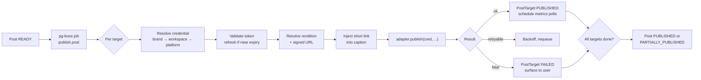

# 08 — Platform integrations

> **Status:** partially implemented — the adapter contract, the registry, the error
> taxonomy and the **X** adapter have landed (W6 PR 1). Facebook, Instagram and Threads
> are still proposed.
> **v1 targets:** Instagram, Facebook, Threads, X.
> **Credentials:** clients bring their own platform app credentials.
> See [ADR-0005](./adr/0005-v1-platform-targets.md), [ADR-0009](./adr/0009-byo-platform-credentials.md),
> and [10 — Credentials & security](./10-credentials-and-security.md).

> [!IMPORTANT]
> Platform API capabilities, pricing tiers, review requirements, and endpoint shapes
> change frequently. **Verify every specific claim in this document against current
> official documentation before implementing.** The sequencing and architectural guidance
> here is durable; the details are not.

## The critical path

**BYO credentials removes app review from the critical path for phase 1 publishing.**
Rise & Shore and TaxDedux have already completed business verification and hold approved
apps; Buzzalicious runs OAuth and publishes using their app credentials.

Two external tracks remain, neither blocking:

```mermaid
gantt
    title Approval tracks vs. build track
    dateFormat X
    axisFormat %s
    section External (non-blocking)
    Client credential onboarding + pre-flight      :a1, 0, 1
    Buzzalicious read-only app (trend collection)  :a2, 0, 5
    PLATFORM_APP review (future clients, deferred) :a3, 0, 7
    section Internal
    Foundation + teardown        :c1, 0, 2
    Template engine              :c2, after c1, 3
    Composer + export            :c3, after c2, 2
    Credentials + publishing     :c4, after c3, 2
    Outcome spine                :c5, after c2, 2
```



Units are indicative, not a schedule.

Two consequences worth holding onto. First, **client credential onboarding becomes the new
gating step** — it is short, but it is a prerequisite and it is partly outside our control
(the client must register our callback and may need to request extra permissions). Second,
export/download and first-party analytics stay P0 regardless, because a client whose
capability pre-flight comes back `INSUFFICIENT` still needs a working product.

## Why these four platforms cluster well

Instagram, Facebook, and Threads all sit behind Meta developer infrastructure — one
developer account, one business verification, largely one review track. For a BYO client
that means **they hand us one Meta app, not three.** LinkedIn and TikTok (P1) each add
their own.

## Meta: Instagram, Facebook, Threads

### Prerequisites

These are now largely the **client's** responsibility, verified by us at pre-flight:

- Meta developer account and a Meta app *(client)*
- **Business verification** — requires real business documentation *(client, usually done)*
- App review for each permission we need *(client — check their granted scopes cover ours)*
- **Instagram publishing requires an Instagram Business or Creator account linked to a
  Facebook Page.** Personal Instagram accounts cannot publish via API.

> Both constraints must be surfaced in onboarding UX, not discovered at connect or publish
> time. The capability pre-flight in [10](./10-credentials-and-security.md) exists exactly
> for this: it turns "your scheduled post failed three weeks from now" into "request this
> permission today."

### Permissions to expect

Verify current names and requirements against Meta's documentation. Broadly, publishing
and insights for Instagram and Facebook Pages require a set of business-scoped permissions
plus page/content publishing permissions. Threads uses its own API with its own scopes.

### Publishing model

Instagram's Content Publishing API is **two-phase**: create a media container, then publish
it. The container references a **publicly accessible media URL** — the image must be
reachable by Meta's servers.

This has a direct architectural consequence: **renditions in R2 need signed or public URLs
with a lifetime long enough for Meta to fetch them.** Design the storage layer for this
from the start rather than discovering it during integration. It is also a privacy
consideration worth being deliberate about — prefer time-limited signed URLs over
permanently public objects.

Expect per-account daily publishing quotas; surface remaining quota in the UI rather than
failing at publish time.

### Metrics

Instagram Insights exposes reach, impressions, saves, and engagement for business
accounts. Availability differs by media type and account type, and some metrics have
minimum-follower thresholds. Treat every metric as nullable.

### Threads

The Threads API is newer and narrower than Instagram's. Treat capabilities as best-effort,
implement publishing first, and expect metrics coverage to be thinner.

## X

- Simpler and faster to access than Meta — **no app review gate**, which is why X is the
  first adapter to implement.
- **Access tiers carry real cost.** Under BYO this cost sits with the client, who brings
  their own X app and tier. We must still surface which tier a credential is on, because
  posting limits and metrics availability differ by tier and a lower tier silently
  degrades the outcome spine.
- The existing prototype already posts successfully via `twitter-api-v2` using OAuth 1.0a.
  That code is the starting point ([03](./03-teardown.md)), and the handshake is captured
  verbatim in [`reference/x-oauth1a.md`](./reference/x-oauth1a.md).
- Media upload is a separate step from posting — implement media upload before assuming
  image posts work. Concretely: **upload is `client.v1.uploadMedia`, posting is
  `client.v2.tweet`** — two API versions in one client. Maximum four images per post.

### Client setup — what a BYO client must do

Under [ADR-0009](./adr/0009-byo-platform-credentials.md) the client owns the X app, so
these are onboarding instructions to hand them, not steps we perform. Verify against the
current X developer documentation before publishing them to a client — tier names and
permission labels change.

1. Create a project and an app in the X developer portal.
2. Enable **OAuth 1.0a** under the app's user authentication settings.
3. Set app permissions to **Read and Write**. The default is read-only, and posting with
   it fails as `Read-only application cannot POST` — a message that does not mention
   permissions.
4. Register the callback URL. We give the client a **single canonical URL**
   (`https://<app-domain>/auth/x/callback`) that they register once; see
   [10 — Credentials & security](./10-credentials-and-security.md).
5. Confirm the access tier permits posting and the metrics we need. A write-capable tier
   is not free, and a lower tier degrades the outcome spine silently rather than loudly.
6. Hand over the **API key** and **API secret** (consumer key/secret) through the
   write-only credential fields. They are encrypted at rest and never returned by the API.

### Failure modes worth pre-empting in the capability report

| Symptom | Cause |
|---------|-------|
| `Read-only application cannot POST` | App permissions never changed from the read-only default |
| `403 Forbidden` on publish | Access tier does not include write |
| `Invalid or expired token` | User revoked access — OAuth 1.0a tokens do not expire on their own |
| `Status is a duplicate` | X rejects identical text posted twice. Relevant to retries: **a retry of a successful-but-unacknowledged post looks like a duplicate**, so the idempotency key matters here specifically |

### Rate limits

X enforces per-window posting limits that vary by tier. Publishing must treat a
rate-limit response as retryable with backoff (`RateLimitError`), not as a failure —
see the error taxonomy below.

## Adapter interface

Every platform implements the same contract, so adding LinkedIn or TikTok later is a new
file rather than a change to the publishing pipeline.

> [!IMPORTANT]
> **Every method takes a `ResolvedCredential`.** No adapter reads app credentials from the
> environment. This is what makes BYO work, and it must be true from the first adapter —
> retrofitting it means touching every method signature and every call site.

```ts
interface ResolvedCredential {
  id: string | null;              // null = PLATFORM_APP
  mode: 'CLIENT_APP' | 'PLATFORM_APP';
  appId: string;
  appSecret: string;              // decrypted, in-memory only
  systemUserToken?: string;
  redirectUri: string;
  grantedScopes: string[];
}

interface PlatformAdapter {
  readonly platform: Platform;
  readonly specs: PlatformSpec;

  getAuthUrl(cred: ResolvedCredential, state: string): string;
  connect(cred: ResolvedCredential, code: string): Promise<ConnectedAccount[]>;
  refresh(cred: ResolvedCredential, account: SocialAccount): Promise<TokenSet>;
  validate(cred: ResolvedCredential, account: SocialAccount): Promise<AccountHealth>;

  // Pre-flight: what is this credential actually approved to do?
  introspect(cred: ResolvedCredential): Promise<CapabilityReport>;

  publish(cred: ResolvedCredential, input: PublishInput): Promise<PublishResult>;
  fetchMetrics(cred: ResolvedCredential, target: PostTarget): Promise<PlatformMetrics>;
}

interface PlatformSpec {
  captionMaxLength: number;
  supportedRatios: AspectRatio[];
  mediaRequired: boolean;
  supportsScheduling: boolean;        // native scheduling vs. our own
  hashtagLimit?: number;
  linkBehavior: 'inline' | 'bio-only' | 'first-comment';
  requiredScopes: Record<Capability, string[]>;
}
```

`connect()` returns an **array** because one Meta authorization can yield several
publishable destinations (multiple Pages, linked Instagram accounts).

`introspect()` powers the capability pre-flight described in
[10](./10-credentials-and-security.md). `requiredScopes` is what it compares against.

`PlatformSpec` drives the composer UI — caption limits, ratio options, and link placement
warnings come from the adapter rather than being hardcoded per screen. `linkBehavior`
matters directly for the outcome spine: Instagram feed captions don't render clickable
links, so short links need a bio-link or first-comment strategy there while working
inline on X and Facebook. **Decide the Instagram link strategy during W6**, because it
affects how much click data Instagram posts can produce.

## Publishing pipeline



**Each `PostTarget` is published by its own job.** One platform failing must never block
the others — with four targets, partial failure is the common case, not the exception.
This is the single biggest behavioral improvement over the prototype's scheduler, which
processes platforms inline in one function with no retry.

**Jobs carry a `credentialId`, never a secret.** Resolution and decryption happen at
execution time, so a secret never sits at rest in a job payload or a queue table.

### Error taxonomy

| Class | Examples | Handling |
|-------|----------|----------|
| **Transient** | 5xx, timeout, rate limit | Exponential backoff, retry up to N |
| **Auth** | expired/revoked token | Mark `SocialAccount` `EXPIRED`/`REVOKED`, notify user, do not retry blindly |
| **Credential** | app secret invalid or rotated | Mark `PlatformCredential` `INVALID`, block the workspace's jobs for that platform, alert |
| **Validation** | caption too long, bad media | Fail fast, surface an actionable message; never retry |
| **Policy** | content rejected | Fail, surface verbatim platform reason |
| **Quota** | daily limit reached | Reschedule past the window rather than failing |

The prototype stores a raw error string per platform. Typed classification is what lets
the UI say "reconnect your Instagram account" instead of "publish failed." The
**credential** class is distinct from **auth** on purpose: one client action fixes many
broken accounts at once, so the UI should point at the credential, not at each account.

## Token lifecycle

- All tokens and app secrets **encrypted at rest**, decrypted only in the adapter
  ([10](./10-credentials-and-security.md)).
- Every `SocialAccount` records the `credentialId` that minted its token. **Refresh is only
  possible with the app that issued it** — this link is load-bearing, not bookkeeping.
- A pg-boss cron job refreshes tokens **before** expiry, using the
  `@@index([status, expiresAt])` on `social_accounts`.
- Meta long-lived tokens need periodic refresh; X OAuth 1.0a tokens don't expire but can
  be revoked. Meta **system user** tokens, where a client provides one, are reported not to
  expire — verify this before relying on it.
- A daily `validate()` sweep covers both accounts and credentials. Silent revocation
  causing posts to quietly stop publishing is one of the worst failure modes for a
  scheduling product — find out before the user does.

## The export fallback

**Every post must be downloadable regardless of connection state.** Non-negotiable:

- It makes the product useful before credentials are onboarded or approved
- It covers platforms we don't support yet
- It's the escape hatch when an API breaks or an account is disconnected
- It de-risks the entire integration track — if a client's app lacks a permission, the
  product still works

Export delivers per-platform renditions plus caption text, ready to paste.

## Build order for W6

1. **Credential storage, resolution, and pre-flight first** — see
   [10](./10-credentials-and-security.md). No adapter work starts before the interface
   takes a `ResolvedCredential`.
2. `PlatformAdapter` interface + `PlatformSpec` registry
3. X adapter: OAuth connect, media upload, publish, metrics, `introspect`
4. pg-boss publish pipeline with per-target jobs, retry, and error classification
5. Proactive token refresh + validation sweep, keyed by `credentialId`
6. Export/download bundle
7. Meta adapters — Facebook first (simplest), then Instagram, then Threads
8. Scheduling UI and calendar
9. Quota, credential health, and account health surfacing in the UI

## P1 platforms

**LinkedIn** — prototype code exists and is parked in `docs/reference/`. Straightforward
OAuth 2.0; lands quickly once the adapter interface is stable.

**TikTok** — requires its own app review, and content-posting has additional requirements.
Its value is high for the trend engine even before publishing works, since TikTok is where
formats originate.

## Implementation notes (W6 PR 1)

### The adapter contract is credential-first

Every `PlatformAdapter` method takes a resolved credential as its first argument. No
adapter reads `process.env`, and none of them touches the database — `getAuthUrl` receives
a `persistRequestToken` sink rather than writing the OAuth 1.0a request token itself. That
keeps ADR-0009 enforceable by inspection rather than by discipline.

### X pre-flight cannot report write permission

`introspect()` on X reports every capability as supported. This is a real limitation, not
an oversight: OAuth 1.0a has no scopes, so there is nothing to compare a requirement
against. The credential's *access level* (read vs. read-write) lives in the X developer
portal and is not exposed on any endpoint we can call cheaply.

The consequence is that a read-only X app passes pre-flight and fails at publish time. It
fails *well* — X returns a 403 whose body says the app is not configured for writes, and
`classifyPlatformError` matches that message before it matches the status, so it is
classified `CREDENTIAL` rather than `POLICY`, marks the target `BLOCKED` rather than
`FAILED`, and tells the user to check their app's access level. But the report is
optimistic, and a connections page must not present a green X tick as proof that posting
will work.

`evaluateCapabilities` returns "supported" for a scopeless protocol deliberately, for the
same reason: reporting "unsupported" because the granted-scope list is empty would make
every correctly configured X credential look broken.

### Message rules run before status rules

`classifyPlatformError` checks the error text before the HTTP status. A 403 from X means
"read-only app" (a credential problem the user can fix) far more often than it means
"forbidden action" (a policy problem they cannot). Classifying on status alone would send
every one of those to the wrong place. A 429 is the exception and always wins, because
rate limiting is never anything but transient.

One detail worth keeping: on `twitter-api-v2` the HTTP status is on `.code`, not
`.status`, and the useful text is on `.data.detail` — `.message` is a generic wrapper.
Classifying on `.message` alone means the read-only rule never fires at all.
