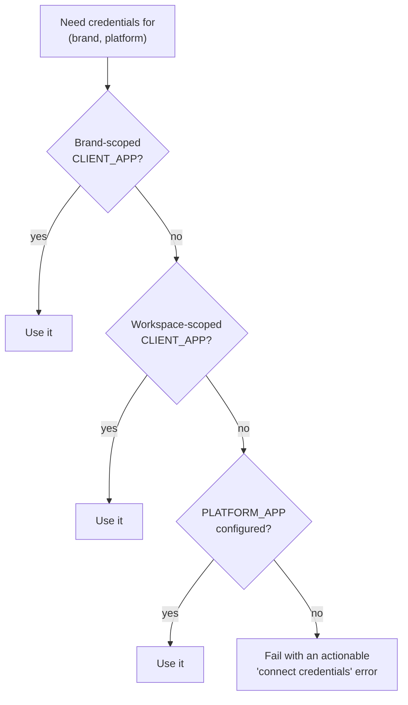
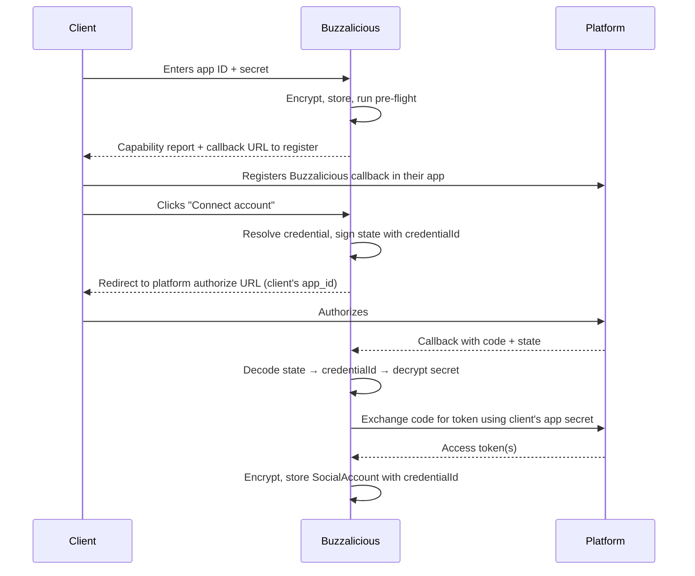

# 10 — Credentials & security

> **Status:** partially implemented — storage, the resolver, pre-flight, the access log
> and the signed-state OAuth handshake have landed (W6 PR 1). Per-workspace DEKs and the
> rotation runbook have not; see "Deferred" below.
> **Decision:** dual-mode credentials, `CLIENT_APP` first.
> See [ADR-0009](./adr/0009-byo-platform-credentials.md).

Holding client platform app secrets raises the security stakes materially. A leaked user
access token lets an attacker post as one account until it's revoked. A leaked **app
secret** lets an attacker mint tokens, impersonate the client's application, and
potentially reach every asset that app is authorized for. This document treats credentials
as the most sensitive data in the system, because they are.

## Credential modes

| Mode | Whose app | Secrets stored | Typical client |
|------|-----------|----------------|----------------|
| `DIRECT_TOKEN` | Client's app, token pasted in | Long-lived access token — **encrypted in the database** | Day-one migration of Rise & Shore and Tax Dedux |
| `CLIENT_APP` | Client's platform app | App ID + secret, and/or system user token — **encrypted in the database** | Durable publishing; agencies; verified businesses |
| `PLATFORM_APP` | Buzzalicious's app | **In config vars — never in the application database** | Non-technical small businesses (deferred) |

Keeping our own app secrets out of the application database is deliberate: a database
compromise then exposes client credentials but not the platform-wide app that every
`PLATFORM_APP` client depends on.

> **`DIRECT_TOKEN` is a bootstrap mode, not a destination.** Meta tokens expire in roughly
> 60 days and cannot be refreshed without the app secret. Every `DIRECT_TOKEN` credential
> must record an expiry, warn ahead of it, and prompt an upgrade to `CLIENT_APP`. A
> platform whose publishing silently dies every two months is not a product.
> X OAuth 1.0a tokens don't expire, so `DIRECT_TOKEN` is legitimately durable there.

## Resolution



A `CredentialResolver` service is the **only** path to credentials. No adapter, job, or
route reads app secrets directly. This single choke point is what makes auditing,
rotation, and access logging tractable.

## Data model additions

Extends [02 — Data model](./02-data-model.md).

```prisma
enum CredentialMode {
  DIRECT_TOKEN
  CLIENT_APP
  PLATFORM_APP
}

model PlatformCredential {
  id              String   @id @default(uuid())

  // Scope: brandId set = brand-specific; null = shared across the workspace
  workspaceId     String
  workspace       Workspace @relation(fields: [workspaceId], references: [id], onDelete: Cascade)
  brandId         String?
  brand           Brand?    @relation(fields: [brandId], references: [id], onDelete: Cascade)

  platform        Platform
  mode            CredentialMode
  label           String                  // "TaxDedux Meta App"

  // CLIENT_APP
  appId           String?
  appSecret       String?                 // encrypted
  redirectUri     String?

  // DIRECT_TOKEN / Meta system user
  directToken     String?                 // encrypted
  directTokenSecret String?               // encrypted; X OAuth 1.0a
  systemUserToken String?                 // encrypted
  tokenExpiresAt  DateTime?               // drives expiry warnings

  // What the client's app is actually approved for, discovered at pre-flight
  grantedScopes   String[]
  requiredScopes  String[]
  capabilities    Json?                   // per-capability supported/blocked + reason

  status          CredentialStatus @default(PENDING)
  lastValidatedAt DateTime?
  lastError       String?
  rotatedAt       DateTime?
  createdAt       DateTime @default(now())
  updatedAt       DateTime @updatedAt

  socialAccounts  SocialAccount[]
  accessLogs      CredentialAccessLog[]

  @@index([workspaceId, platform, status])
  @@index([status, tokenExpiresAt])
  @@map("platform_credentials")
}

enum CredentialStatus {
  PENDING        // entered, not yet validated
  ACTIVE
  INSUFFICIENT   // valid, but missing scopes we need
  INVALID        // rejected by the platform
  REVOKED
}

model CredentialAccessLog {
  id           String   @id @default(uuid())
  credentialId String
  credential   PlatformCredential @relation(fields: [credentialId], references: [id], onDelete: Cascade)
  occurredAt   DateTime @default(now())
  actor        String              // "job:publish.post" | "user:<id>" | "job:token.refresh"
  action       String              // "decrypt" | "rotate" | "validate" | "revoke"
  context      Json?

  @@index([credentialId, occurredAt])
  @@map("credential_access_logs")
}
```

### `SocialAccount` change

```prisma
model SocialAccount {
  // ...existing fields...
  credentialId String?
  credential   PlatformCredential? @relation(fields: [credentialId], references: [id])
  // null = minted by the PLATFORM_APP
}
```

**This link is not optional bookkeeping.** A token can only be refreshed by the app that
issued it. Without `credentialId`, a workspace holding two Meta apps has no way to know
which secret refreshes which token — and the token becomes unrecoverable when it expires.
Rotating a client's app secret must likewise invalidate exactly the accounts minted by it.

## Envelope encryption

**Key custody for v1 ([Q14](./09-open-questions.md)): a Heroku config var**, not a managed
KMS. Appropriate while the only tenants are internal; the audit-trail and key-custody
arguments for KMS only bind once an external client can ask who reads their secrets.

Two constraints keep that upgrade cheap:

- **Versioned ciphertext.** Every encrypted value carries a scheme/key version prefix, so
  rotation and re-wrapping are incremental rather than one big migration.
- **One crypto module with a `KeyProvider` seam.** Swapping config-var for KMS must be one
  new implementation, not a search across the codebase.

The structure to build toward:

- **Per-workspace data encryption key (DEK)**, generated at workspace creation.
- DEKs are wrapped by a **key encryption key (KEK)** — the config var today, a KMS key
  later — and never stored unwrapped.
- Secrets are encrypted with the workspace DEK; the wrapped DEK is stored alongside.

Why per-workspace DEKs are worth it even now: a single global key means one compromise
exposes every client's secrets, and "rotate this client's keys" becomes a global
re-encryption. Per-workspace DEKs contain the blast radius to one tenant.

> **Back up the KEK separately from the database.** A restore that loses the key is
> unrecoverable data, not recoverable downtime ([Q22](./09-open-questions.md)).

## Handling rules

**Never:**
- Log a secret, or any prefix of one, at any level
- Return a secret through the API — not even to the workspace owner who entered it
- Include secrets in error messages, stack traces, or exception reporting
- Store secrets in job payloads; jobs carry a `credentialId` and resolve at execution
- Commit a secret to the repo, including in `.env.example`

**Always:**
- Write secrets through write-only API fields; display as `••••••••` plus the last 4
  characters for identification
- Decrypt at the last possible moment, inside the adapter, and hold in memory only for the
  call
- Log an access-log row on every decrypt
- Redact aggressively in Pino — allow-list what gets logged rather than deny-listing secrets

## Capability pre-flight

A client's app may be approved for a narrower permission set than we need. Discovering
that during a scheduled publish three weeks later is the worst possible outcome.

On credential entry, and on a recurring validation sweep:

1. Verify the credential authenticates at all
2. Introspect granted permissions
3. Compare against `requiredScopes` per capability (publish image, publish video, read
   insights, read hashtag data)
4. Persist a `capabilities` map and set status `ACTIVE` / `INSUFFICIENT` / `INVALID`
5. **Show the client a plain-language report:** what works, what doesn't, and the specific
   permission they need to request

This converts an invisible failure mode into a solvable onboarding task, and it is one of
the highest-value pieces of UX in the whole credential flow.

## Instagram pre-flight, specifically

Independent of credentials, Instagram publishing requires a **Business or Creator account
linked to a Facebook Page.** Many small businesses run personal accounts. Detect this
during onboarding and explain the conversion — never at publish time.

## OAuth flow under BYO



**The `state` parameter must be signed and must carry the `credentialId`.** Without it the
callback cannot know which app secret to use for the exchange. Treat it as security-
relevant, not incidental: unsigned state is a CSRF vector, and one that now selects which
client's secret gets used.

A **single canonical callback URL** (`https://<app-domain>/auth/:platform/callback`) is
used for every client, so each client registers one URL once.

## Rotation, revocation, offboarding

**Rotation** — client rotates their app secret: update the credential, re-run pre-flight,
mark dependent `SocialAccount` rows for re-authorization. Existing tokens usually survive,
but refresh will fail, so validate rather than assume.

**Revocation** — credential marked `REVOKED`: halt all jobs using it, mark dependent
accounts `REVOKED`, surface prominently in the UI. Scheduled posts move to a blocked state
rather than failing silently.

**Offboarding** — client leaves: delete credentials and tokens, attempt platform-side token
revocation, retain access logs for the audit window, and confirm deletion to the client in
writing.

Each needs a written runbook before the first external client onboards.

## Legal & compliance

- Buzzalicious acts as a **data processor** on behalf of the client. A data processing
  agreement is likely required.
- **Verify each platform's terms on third parties holding app secrets.** Agencies do this
  routinely, but confirm rather than assume — a terms violation could cost a client their
  app.
- Document data retention: how long tokens, metrics, and click data persist after
  offboarding.
- First-party click tracking stores salted IP hashes and derived country only
  ([06](./06-outcome-and-feedback-loop.md)) — a genuinely defensible privacy position.

## Build order

Belongs to W6, ahead of any adapter work:

1. `PlatformCredential` + `CredentialAccessLog` models (coordinate with W2)
2. Envelope encryption with per-workspace DEKs, extending W0's crypto module, with a
   `KeyProvider` seam and versioned ciphertext
3. `CredentialResolver` with the three-tier resolution
4. **`DIRECT_TOKEN` entry + migration of the two existing brands** — this unblocks
   publishing immediately ([11](./11-source-material.md))
5. Credential entry UI — write-only fields, masked display, expiry warnings
6. Capability pre-flight + the plain-language report
7. `CLIENT_APP` mode: signed OAuth state carrying `credentialId`, connect flow
8. `PlatformAdapter` methods taking a resolved credential
9. Recurring validation sweep and status transitions
10. Rotation / revocation / offboarding runbooks

## Open items

- Access log retention period
- Whether `PLATFORM_APP` mode ships in phase 1 at all, or only the abstraction
- Backup/restore drill for the KEK ([Q22](./09-open-questions.md))

## Implemented in W6 PR 1

**One decrypt choke point.** `credential.resolver.ts` is the only place a stored secret is
read. Everything else — routes, jobs, adapters — receives a `ResolvedCredential` it did not
fetch. That is what makes the access log complete rather than merely well-intentioned: an
entry cannot be forgotten at a call site, because there is one call site.

**Resolution order.** Brand → workspace → platform app; within a tier, `CLIENT_APP` beats
`DIRECT_TOKEN`. A `DIRECT_TOKEN` is a day-one bootstrap that expires, so a client who has
upgraded should be using the upgrade without having to delete the old row first.

Workspace-level work (`brandId: null`) filters for `brandId: null` explicitly rather than
leaving the brand unconstrained. Unconstrained, every candidate scores identically and the
tie breaks on `createdAt` — so the workspace would silently act as whichever brand happened
to connect first. This was a real bug found during implementation, not a hypothetical.

**Secrets never leave the service layer.** Routes return `CredentialView`, which carries
only masks. `containsSecretField` exists so a job payload can be asserted clean; queue
payloads carry identifiers only and re-resolve at the worker.

**The handshake row.** X's OAuth 1.0a callback returns `oauth_token` and `oauth_verifier`
but *not* `oauth_token_secret`, which is required for the exchange — so it has to be
persisted between legs, encrypted, and it needs an owner. `OAuthHandshake` is that row.

Signed state alone is not enough. A valid signed state is a bearer token that works until
it expires, so single use is enforced in the database by a conditional `updateMany` whose
`where` carries the whole precondition. A read-then-write has a window in which two
concurrent callbacks both see an unconsumed row, and the cost of losing that race is one
authorization exchanged twice.

Every rejection — bad signature, expired, malformed, already consumed — raises the same
error with the same message. Distinguishing them is free information for someone probing
the endpoint, and there is nothing a legitimate user can do differently with any of them.

**Tenant scoping.** `OAuthHandshake` is scoped on its own `brandId`, not its credential's.
Routing it through the credential looks equivalent and is not: a workspace-shared
credential has `brandId: null`, every brand in the workspace legitimately connects through
it, and the indirection makes each brand's in-flight handshake — including its encrypted
request-token secret — readable by every sibling brand. The first version of this rule had
that bug; see `backend/tests/db/publishing.test.ts` for the test that catches it.

## Deferred

**Per-workspace DEKs wrapped by a KEK.** This document specifies envelope encryption with
a data key per workspace. The platform crypto layer is currently single-key, and the
stored format already carries a key identifier (`v1.<keyId>.<iv>.<ct>.<tag>`), so the seam
for a second key exists and is versioned.

The migration itself is deliberately not attempted here. Done half-way it is worse than
not done: a mixture of wrapped and unwrapped values with no way to tell which is which is
harder to fix than a uniformly single-key store, and the re-encryption pass needs a
rotation runbook and an operational owner that PR 1 does not have. It should be its own
change, against a store whose format is already versioned — which it now is.

**Rotation runbook and health sweeps.** `refresh()` and `validate()` are on the adapter
contract and are exercised in tests; the periodic job that calls them across every stored
account, and the runbook for a compromised app secret, are W6 PR 2.
