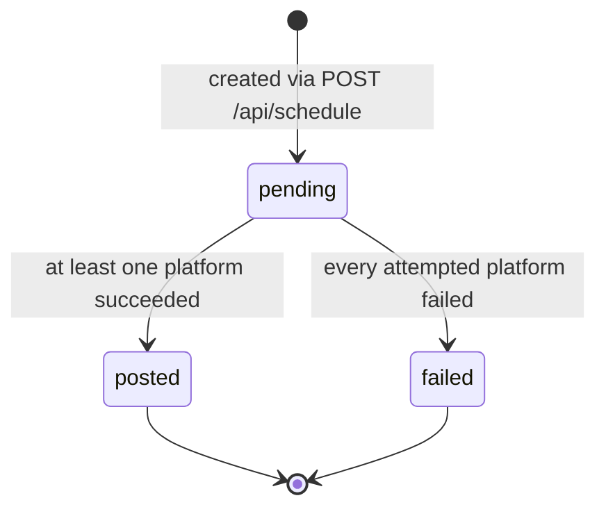

# Scheduled posts — status transitions and what pg-boss must fix

> [!CAUTION]
> **DEAD CODE.** Source: `backend/src/services/scheduler.service.ts` (155 lines) and
> `backend/src/routes/schedule.routes.ts`, both deleted in M1. Replaced wholesale by
> pg-boss ([ADR-0004](../adr/0004-pg-boss-job-queue.md)).

The code is not worth preserving. The **state machine it implied** is, because it is the
same set of states the new publishing pipeline has to model, and because the way the old
one collapsed multi-platform results into a single status is a mistake worth not
repeating.

## The old state machine



Three states, both terminal states final. No `processing`, no `retrying`, no `cancelled`,
no `blocked`. Selection was:

```ts
const duePosts = await prisma.scheduledPost.findMany({
  where: {
    status: 'pending',
    scheduledFor: { lte: now },
  },
  include: { user: true },
});
```

...and the loop ran every 60 seconds:

```ts
// Start the scheduler (runs every minute)
static startScheduler(): NodeJS.Timeout {
  console.log('Starting post scheduler...');

  // Run immediately on startup
  this.processDuePosts();

  // Then run every minute
  return setInterval(() => {
    this.processDuePosts();
  }, 60 * 1000); // 60 seconds
}
```

## Per-platform results, and how they collapsed

Each platform's outcome was tracked in its own column triple —
`<platform>PostId`, `<platform>PostedAt`, `<platform>Error` — and then flattened:

```ts
// Determine overall status
let status = 'failed';
if (platform === 'twitter' && twitterSuccess) {
  status = 'posted';
} else if (platform === 'linkedin' && linkedinSuccess) {
  status = 'posted';
} else if (platform === 'both' && (twitterSuccess || linkedinSuccess)) {
  status = 'posted';
}
```

**`'both'` with one platform failing is recorded as `posted`.** The failure is captured in
`linkedinError` and never surfaced. A user sees a green check on a post that went to one
of two places.

The fix is structural, not a better conditional: **status belongs on a per-target row, not
on the parent post.** `docs/02-data-model.md` already separates `Post` from `PostTarget`
for exactly this reason. One target failing is one target failing.

## Everything that was missing

Each of these is a reason [ADR-0004](../adr/0004-pg-boss-job-queue.md) chose a real queue.

| Gap | The old behavior | What pg-boss gives us |
|-----|------------------|----------------------|
| **Locking** | `findMany` with no lock or claim. Two web dynos both find the same due post and both publish it. **Duplicate posts.** | `SKIP LOCKED` claim semantics; a job is delivered to one worker |
| **Retry** | None. One transient 503 from X is a permanent `failed`. | Retry with exponential backoff and a configurable cap |
| **Backoff** | None. | Built in |
| **Dead-lettering** | None — failures rotted in a terminal state. | Dead-letter queue for inspection and replay |
| **Scheduling precision** | Up to 60s late, plus however long the previous pass took. Serial `for` loop, `await` per post. | Per-job `startAfter`; concurrent handlers |
| **Crash safety** | A crash mid-publish leaves `pending` with the post possibly already live. Next tick publishes it **again**. | Durable job state in Postgres; at-least-once with an idempotency key on the target |
| **Platform extensibility** | `if (platform === 'twitter' \|\| platform === 'both')` — hardcoded two-platform branching that does not extend to four. | One `publish.target` job per target, dispatched through `PlatformAdapter` |
| **Observability** | `console.log` per post into a single stream. | Structured job records, attempt counts, durations |
| **Startup burst** | `this.processDuePosts()` fires immediately on boot, unawaited, on every dyno simultaneously. | Workers poll a shared queue |

## The unawaited-floating-promise bug

```ts
// Run immediately on startup
this.processDuePosts();
```

Not awaited, and `processDuePosts` swallows its own errors into `console.error`. On a
two-dyno Heroku deploy, both dynos run this within milliseconds of each other on release.
With no locking, that is the duplicate-post scenario above, triggered by every single
deploy.

## What the new pipeline must carry forward

- Per-target status, never a collapsed parent status
- An idempotency key per `(post, platform, account)` so at-least-once delivery does not
  become at-least-once *posting*
- Distinct terminal states: `PUBLISHED`, `FAILED`, `CANCELLED`, and — new, from
  [10 — Credentials & security](../10-credentials-and-security.md) — `BLOCKED` for a
  revoked or insufficient credential, so scheduled posts stop rather than fail silently
- The error string per target, surfaced in the UI rather than written to a column nobody
  reads
